# Abstrauth & OIDC Integration

This document describes how Abnemo integrates with [Abstrauth](https://github.com/abstratium-dev/abstrauth) for OAuth 2.0 / OpenID Connect (OIDC) authentication using the **Backend-For-Frontend (BFF)** pattern.

## Overview

Abnemo implements a secure authentication flow where:
- The **backend** (Flask server) handles all OAuth negotiations
- **JWT tokens never reach the browser** - they're stored server-side only
- The browser receives only an **HTTP-only session cookie**
- PKCE (Proof Key for Code Exchange) is used for additional security

This BFF pattern ensures that sensitive tokens, client secrets, and PKCE parameters remain on the server, protecting them from XSS attacks and browser-based vulnerabilities.

## Architecture

```mermaid
sequenceDiagram
    participant Browser
    participant Abnemo as Abnemo Backend<br/>(Flask + BFF)
    participant SessionStore as In-Memory<br/>Session Store
    participant Abstrauth as Abstrauth<br/>(OIDC Provider)

    Note over Browser,Abstrauth: 1. Initial Access (Unauthenticated)
    Browser->>Abnemo: GET /
    Abnemo->>SessionStore: Create new session
    SessionStore-->>Abnemo: session_id (random token)
    Abnemo-->>Browser: Set-Cookie: abnemo_session=<session_id><br/>(HttpOnly, Secure, SameSite=Lax)
    Abnemo-->>Browser: Render page with login button

    Note over Browser,Abstrauth: 2. OAuth Login Flow Initiation
    Browser->>Abnemo: GET /oauth/login
    Abnemo->>Abnemo: Generate PKCE code_verifier
    Abnemo->>Abnemo: Generate code_challenge = SHA256(code_verifier)
    Abnemo->>Abnemo: Generate random state parameter
    Abnemo->>SessionStore: Store {code_verifier, state} in session
    Abnemo->>Abnemo: Build authorization URL with:<br/>- client_id<br/>- redirect_uri<br/>- scope (openid profile email)<br/>- state<br/>- code_challenge<br/>- code_challenge_method=S256
    Abnemo-->>Browser: 302 Redirect to Abstrauth

    Note over Browser,Abstrauth: 3. User Authentication at Abstrauth
    Browser->>Abstrauth: GET /oauth2/authorize?client_id=...&code_challenge=...
    Abstrauth-->>Browser: Show login page
    Browser->>Abstrauth: POST credentials
    Abstrauth->>Abstrauth: Validate user credentials
    Abstrauth->>Abstrauth: Check user groups
    Abstrauth-->>Browser: 302 Redirect to callback with code & state

    Note over Browser,Abstrauth: 4. OAuth Callback & Token Exchange
    Browser->>Abnemo: GET /oauth/callback?code=...&state=...
    Abnemo->>SessionStore: Retrieve session by cookie
    SessionStore-->>Abnemo: {code_verifier, state}
    Abnemo->>Abnemo: Validate state parameter matches
    Abnemo->>Abstrauth: POST /oauth2/token<br/>grant_type=authorization_code<br/>code=...<br/>client_id=...<br/>client_secret=...<br/>code_verifier=...<br/>redirect_uri=...
    Abstrauth->>Abstrauth: Verify code_verifier matches code_challenge
    Abstrauth->>Abstrauth: Validate client credentials
    Abstrauth-->>Abnemo: {<br/>  access_token: "eyJhbG...",<br/>  id_token: "eyJhbG...",<br/>  refresh_token: "...",<br/>  expires_in: 3600<br/>}
    
    Note over Browser,Abstrauth: 5. Token Storage & Session Update
    Abnemo->>Abnemo: Parse JWT claims from id_token:<br/>- sub (user ID)<br/>- email<br/>- name<br/>- groups[]
    Abnemo->>SessionStore: Update session:<br/>{<br/>  authenticated: true,<br/>  tokens: {access_token, refresh_token, expires_at},<br/>  user: {sub, email, name, groups}<br/>}
    Abnemo-->>Browser: 302 Redirect to /
    Browser->>Abnemo: GET /
    Abnemo->>SessionStore: Get session by cookie
    SessionStore-->>Abnemo: {authenticated: true, user: {...}}
    Abnemo->>Abnemo: Check if user has required group
    Abnemo-->>Browser: Render authenticated dashboard

    Note over Browser,Abstrauth: 6. Authenticated API Requests
    Browser->>Abnemo: GET /api/traffic<br/>Cookie: abnemo_session=...
    Abnemo->>SessionStore: Get session by cookie
    SessionStore-->>Abnemo: {authenticated: true, user: {groups: [...]}}
    Abnemo->>Abnemo: Verify user has required group
    alt User has required group
        Abnemo-->>Browser: 200 OK {traffic data}
    else Missing required group
        Abnemo-->>Browser: 403 Forbidden<br/>{code: "missing_required_group"}
    end

    Note over Browser,Abstrauth: 7. Logout Flow
    Browser->>Abnemo: POST /api/logout<br/>X-CSRF-Token: ...<br/>Cookie: abnemo_session=...
    Abnemo->>Abnemo: Validate CSRF token
    Abnemo->>SessionStore: Delete session
    Abnemo-->>Browser: Clear-Cookie: abnemo_session<br/>200 OK {success: true}
```



## OIDC Compatibility

Abnemo is compatible with any **OpenID Connect (OIDC) 1.0** compliant provider, not just Abstrauth. The implementation follows standard OIDC specifications:

### OIDC Features Supported

| Feature | Support | Notes |
|---------|---------|-------|
| **Authorization Code Flow** | ✅ | Primary flow with PKCE |
| **PKCE (RFC 7636)** | ✅ | S256 code challenge method |
| **OpenID Connect Core** | ✅ | Standard OIDC claims (sub, email, name) |
| **Custom Claims** | ✅ | Supports `groups` claim for RBAC |
| **Token Refresh** | ⚠️ | Refresh tokens stored but not auto-refreshed |
| **Implicit Flow** | ❌ | Not supported (less secure) |
| **Client Credentials** | ❌ | Not applicable (user authentication) |

### Required OIDC Endpoints

The OIDC provider must expose:

1. **Authorization Endpoint** - e.g., `https://auth.example.com/oauth2/authorize`
2. **Token Endpoint** - e.g., `https://auth.example.com/oauth2/token`

### Required OIDC Scopes

- `openid` - Required for OIDC compliance
- `profile` - For user name
- `email` - For user email
- Custom scopes as needed

## JWT Token Handling

### How JWTs are Obtained

1. **User initiates login** → Browser redirected to `/oauth/login`
2. **PKCE parameters generated** → `code_verifier` and `code_challenge` created server-side
3. **Authorization request** → User redirected to Abstrauth with `code_challenge`
4. **User authenticates** → Abstrauth validates credentials
5. **Authorization code issued** → Abstrauth redirects back with `code` and `state`
6. **Token exchange** → Abnemo backend exchanges code for tokens using `code_verifier`
7. **JWT received** → Backend receives `access_token`, `id_token`, and optionally `refresh_token`

### JWT Structure

The `id_token` is a standard JWT with three parts:

```
eyJhbGciOiJSUzI1NiIsInR5cCI6IkpXVCJ9.eyJzdWIiOiIxMjM0NTY3ODkwIiwibmFtZSI6IkpvaG4gRG9lIiwiZW1haWwiOiJqb2huQGV4YW1wbGUuY29tIiwiZ3JvdXBzIjpbImFibmVtb19hZG1pbnMiXSwiaWF0IjoxNTE2MjM5MDIyLCJleHAiOjE1MTYyNDI2MjJ9.signature
```

**Header** (decoded):
```json
{
  "alg": "RS256",
  "typ": "JWT"
}
```

**Payload** (decoded):
```json
{
  "sub": "1234567890",
  "name": "John Doe",
  "email": "john@example.com",
  "groups": ["abnemo_admins"],
  "iat": 1516239022,
  "exp": 1516242622
}
```

**Signature**: Cryptographic signature (not verified by Abnemo - trust is delegated to Abstrauth)

### JWT Claims Extraction

The backend parses JWT claims **without cryptographic verification** because:
- Tokens are obtained directly from the trusted OIDC provider over HTTPS
- They never pass through the browser or untrusted intermediaries
- The BFF pattern ensures tokens come from a trusted source

```python
def _parse_jwt_claims(token):
    """Parse JWT token claims without verification (for display only)"""
    if not token or '.' not in token:
        return {}
    try:
        payload = token.split('.')[1]  # Get payload section
        padded = payload + '=' * (-len(payload) % 4)  # Add padding
        decoded = base64.urlsafe_b64decode(padded)
        return json.loads(decoded.decode('utf-8'))
    except Exception:
        return {}
```

Claims extracted:
- `sub` - Subject (unique user identifier)
- `email` - User email address
- `name` - User display name
- `groups` - Array of group memberships (custom claim)

## Token Storage

### Where Tokens are Stored

**Tokens are NEVER sent to the browser.** They are stored exclusively in the **in-memory session store** on the backend.

```python
class MemorySessionStore:
    """Simple in-memory session storage for BFF state."""
    
    def __init__(self, ttl_seconds=3600):
        self.ttl_seconds = ttl_seconds
        self._sessions = {}  # Dictionary: session_id -> session_data
        self._lock = threading.Lock()  # Thread-safe access
```

### Session Data Structure

Each session contains:

```python
{
    '_session_expires_at': datetime(2026, 3, 24, 20, 30, 0),  # Auto-expiry
    'authenticated': True,
    'tokens': {
        'access_token': 'eyJhbGciOiJSUzI1NiIs...',  # JWT access token
        'refresh_token': 'refresh_token_value',      # Optional refresh token
        'expires_at': '2026-03-24T19:30:00Z'         # Token expiration
    },
    'user': {
        'sub': 'user-uuid-1234',
        'email': 'user@example.com',
        'name': 'John Doe',
        'groups': ['abnemo_admins', 'monitoring_team']
    }
}
```

### Session Cookie (Browser)

The browser receives **only a session identifier**, not the tokens:

```
Set-Cookie: abnemo_session=<random_32_byte_token>; 
            HttpOnly;           # JavaScript cannot access
            Secure;             # HTTPS only (if configured)
            SameSite=Lax;       # CSRF protection
            Max-Age=3600;       # 1 hour default
            Path=/
```

### Storage Characteristics

| Aspect | Implementation |
|--------|----------------|
| **Storage Type** | In-memory (Python dictionary) |
| **Persistence** | Non-persistent (lost on server restart) |
| **Thread Safety** | Yes (threading.Lock) |
| **Session ID** | 32-byte random token (URL-safe base64) |
| **Default TTL** | 3600 seconds (1 hour) |
| **Auto-Expiry** | Yes (checked on every access) |
| **Token Refresh** | Stored but not auto-refreshed |

### Security Benefits

1. **No XSS exposure** - Tokens never reach JavaScript
2. **No CSRF exposure** - Session cookie has SameSite=Lax
3. **No token leakage** - Tokens can't be stolen from browser storage
4. **Automatic cleanup** - Expired sessions auto-deleted
5. **Thread-safe** - Concurrent requests handled safely

### Limitations

1. **No persistence** - Sessions lost on server restart
2. **Memory bound** - All sessions stored in RAM
3. **Single server** - No session sharing across multiple instances
4. **No token refresh** - Access tokens expire, requiring re-login

For production deployments requiring persistence and scalability, consider implementing:
- Redis-based session store
- Database-backed sessions
- Automatic token refresh logic

## Configuration

### Required Environment Variables

All configuration is done via environment variables with the `ABSTRAUTH_` prefix:

| Variable | Required | Default | Description |
|----------|----------|---------|-------------|
| `ABSTRAUTH_CLIENT_ID` | ✅ | - | OAuth client ID registered with OIDC provider |
| `ABSTRAUTH_CLIENT_SECRET` | ✅ | - | Client secret (confidential client) |
| `ABSTRAUTH_AUTHORIZATION_ENDPOINT` | ✅ | - | Full URL to `/oauth2/authorize` endpoint |
| `ABSTRAUTH_TOKEN_ENDPOINT` | ✅ | - | Full URL to `/oauth2/token` endpoint |
| `ABSTRAUTH_REDIRECT_URI` | ✅ | - | Callback URL (e.g., `https://monitor.example.com/oauth/callback`) |
| `ABSTRAUTH_SCOPE` | ⛔ | `openid profile email` | Space-delimited OAuth scopes |
| `ABSTRAUTH_SESSION_COOKIE` | ⛔ | `abnemo_session` | Session cookie name |
| `ABSTRAUTH_COOKIE_SECURE` | ⛔ | `false` | Set to `true` for HTTPS-only cookies |
| `ABSTRAUTH_SESSION_TTL` | ⛔ | `3600` | Session lifetime in seconds |
| `ABSTRAUTH_REQUIRED_GROUP` | ⛔ | - | Single required group name |
| `ABSTRAUTH_REQUIRED_GROUPS` | ⛔ | - | Comma-separated list of acceptable groups |

### Example Configuration

```bash
# Abstrauth OIDC Configuration
export ABSTRAUTH_CLIENT_ID="abnemo-monitor"
export ABSTRAUTH_CLIENT_SECRET="super-secret-value-here"
export ABSTRAUTH_AUTHORIZATION_ENDPOINT="https://auth.example.com/oauth2/authorize"
export ABSTRAUTH_TOKEN_ENDPOINT="https://auth.example.com/oauth2/token"
export ABSTRAUTH_REDIRECT_URI="https://monitor.example.com/oauth/callback"

# Optional: Scope configuration
export ABSTRAUTH_SCOPE="openid profile email groups"

# Optional: Role-based access control
export ABSTRAUTH_REQUIRED_GROUPS="abnemo_admins,monitoring_team"

# Optional: Security settings (production)
export ABSTRAUTH_COOKIE_SECURE=true
export ABSTRAUTH_SESSION_TTL=7200  # 2 hours

# CSRF Protection (required)
export FLASK_SECRET_KEY=$(openssl rand -hex 32)
```

### Configuration Validation

On startup, Abnemo checks if all required variables are present:

```python
def build_oauth_config():
    config = {
        'client_id': os.getenv('ABSTRAUTH_CLIENT_ID'),
        'client_secret': os.getenv('ABSTRAUTH_CLIENT_SECRET'),
        'authorization_endpoint': os.getenv('ABSTRAUTH_AUTHORIZATION_ENDPOINT'),
        'token_endpoint': os.getenv('ABSTRAUTH_TOKEN_ENDPOINT'),
        'redirect_uri': os.getenv('ABSTRAUTH_REDIRECT_URI'),
        # ... other config
    }
    
    required = ['client_id', 'client_secret', 'authorization_endpoint', 
                'token_endpoint', 'redirect_uri']
    config['enabled'] = all(config[key] for key in required)
    
    return config
```

**If OAuth is disabled** (missing variables):
- All endpoints remain **open** (no authentication required)
- Suitable for development and local testing
- Warning logged: `OAuth is disabled - all web endpoints are open`

**If OAuth is enabled** (all variables present):
- All web endpoints require authentication
- Unauthenticated requests return `401 Unauthorized`
- Info logged: `OAuth enforcement ENABLED - sign-in required for web endpoints`

## Role-Based Access Control (RBAC)

### Group Enforcement

Abnemo supports group-based authorization using the `groups` claim from the JWT:

```python
def user_has_required_group(session, required_groups):
    """Check if user has at least one of the required groups"""
    if not required_groups:
        return True  # No groups required
    
    user = session.get('user') or {}
    groups = user.get('groups') or []
    
    # User must have at least ONE of the required groups
    return any(group in groups for group in required_groups)
```

### Configuration Examples

**Single group requirement:**
```bash
export ABSTRAUTH_REQUIRED_GROUP="abnemo_admins"
```

**Multiple acceptable groups:**
```bash
export ABSTRAUTH_REQUIRED_GROUPS="abnemo_admins,monitoring_team,security_ops"
```

### Authorization Flow

1. User authenticates successfully
2. Backend extracts `groups` claim from JWT
3. On each protected endpoint request:
   - Session retrieved from cookie
   - User's groups checked against required groups
   - Access granted if user has **at least one** required group
   - `403 Forbidden` returned if missing required group

### API Responses

**Missing required group:**
```json
{
  "error": "Missing required group",
  "code": "missing_required_group",
  "oauth_enabled": true,
  "required_groups": ["abnemo_admins"],
  "user": {
    "sub": "user-123",
    "email": "user@example.com",
    "groups": ["other_team"]
  },
  "has_access": false
}
```

**Successful authorization:**
```json
{
  "authenticated": true,
  "oauth_enabled": true,
  "user": {
    "sub": "user-123",
    "email": "admin@example.com",
    "name": "Admin User",
    "groups": ["abnemo_admins"]
  },
  "required_groups": ["abnemo_admins"],
  "has_access": true
}
```

## API Endpoints

### OAuth Routes

| Endpoint | Method | Description |
|----------|--------|-------------|
| `/oauth/login` | GET | Initiates OAuth login flow, redirects to Abstrauth |
| `/oauth/callback` | GET | Handles OAuth callback, exchanges code for tokens |
| `/api/user` | GET | Returns current user info and authentication status |
| `/api/logout` | POST | Clears session and logs out user (requires CSRF token) |
| `/api/oauth/status` | GET | Returns OAuth configuration status (diagnostics) |

### Protected Endpoints

When OAuth is enabled, these endpoints require authentication:

- `/` - Main dashboard
- `/api/traffic` - Traffic data
- `/api/process/<pid>` - Process information
- `/api/fail2ban/*` - fail2ban endpoints
- `/api/iptables/*` - iptables endpoints
- All other web endpoints

### Authentication Check

All protected endpoints use this middleware:

```python
def _ensure_authenticated_response():
    if not oauth_config['enabled']:
        return None  # OAuth disabled, allow access
    
    session = getattr(g, 'session_data', {})
    
    if not session.get('authenticated'):
        return jsonify({
            'error': 'Authentication required',
            'code': 'not_authenticated',
            'oauth_enabled': True,
            'has_access': False
        }), 401
    
    if oauth_config['required_groups'] and \
       not user_has_required_group(session, oauth_config['required_groups']):
        return jsonify({
            'error': 'Missing required group',
            'code': 'missing_required_group',
            'required_groups': oauth_config['required_groups'],
            'has_access': False
        }), 403
    
    return None  # Authorized
```

## Security Features

### 1. PKCE (Proof Key for Code Exchange)

Protects against authorization code interception attacks:

```python
# Generate random code verifier (43-128 characters)
code_verifier = base64.urlsafe_b64encode(os.urandom(32)).rstrip(b'=').decode('ascii')

# Generate code challenge (SHA256 hash)
code_challenge = base64.urlsafe_b64encode(
    hashlib.sha256(code_verifier.encode('ascii')).digest()
).rstrip(b'=').decode('ascii')
```

Flow:
1. Backend generates `code_verifier` and `code_challenge`
2. `code_challenge` sent to Abstrauth in authorization request
3. Abstrauth stores `code_challenge` with authorization code
4. Backend sends `code_verifier` during token exchange
5. Abstrauth verifies: `SHA256(code_verifier) == code_challenge`

### 2. State Parameter

Prevents CSRF attacks on the OAuth callback:

```python
# Generate random state
state = base64.urlsafe_b64encode(os.urandom(16)).rstrip(b'=').decode('ascii')

# Store in session
session['pkce'] = {'state': state, 'code_verifier': code_verifier}

# Validate on callback
if expected_state != received_state:
    return redirect('/?error=invalid_state')
```

### 3. HTTP-Only Cookies

Session cookies are inaccessible to JavaScript:

```python
response.set_cookie(
    'abnemo_session',
    session_id,
    httponly=True,      # No JavaScript access
    secure=True,        # HTTPS only (production)
    samesite='Lax',     # CSRF protection
    max_age=3600,       # 1 hour
    path='/'
)
```

### 4. CSRF Protection

All state-changing operations require CSRF tokens:

```python
# Logout endpoint
@app.route('/api/logout', methods=['POST'])
def api_logout():
    csrf_token = request.headers.get('X-CSRF-Token') or request.form.get('csrf_token')
    if not csrf_token:
        return jsonify({'error': 'CSRF token missing'}), 403
    
    validate_csrf(csrf_token)  # Raises exception if invalid
    # ... proceed with logout
```

### 5. Session Expiry

Sessions automatically expire after TTL:

```python
def _is_expired(self, session):
    expires_at = session.get('_session_expires_at')
    return bool(expires_at and expires_at < datetime.now(timezone.utc))

def get(self, session_id):
    session = self._sessions.get(session_id)
    if self._is_expired(session):
        del self._sessions[session_id]  # Auto-cleanup
        return None
    # Refresh expiry on access
    session['_session_expires_at'] = datetime.now(timezone.utc) + timedelta(seconds=self.ttl_seconds)
    return session
```

### 6. Secure Token Exchange

Token exchange happens server-to-server over HTTPS:

```python
def exchange_code_for_token(config, code, code_verifier):
    payload = {
        'grant_type': 'authorization_code',
        'code': code,
        'redirect_uri': config['redirect_uri'],
        'client_id': config['client_id'],
        'client_secret': config['client_secret'],  # Never exposed to browser
        'code_verifier': code_verifier
    }
    
    request_obj = urllib.request.Request(
        config['token_endpoint'],
        data=urllib.parse.urlencode(payload).encode('utf-8'),
        headers={'Content-Type': 'application/x-www-form-urlencoded'}
    )
    
    with urllib.request.urlopen(request_obj, timeout=15) as response:
        return json.loads(response.read().decode('utf-8'))
```

## Troubleshooting

### OAuth Not Working

**Check configuration:**
```bash
curl http://localhost:40002/api/oauth/status
```

Response shows:
- `enabled`: true/false
- `client_id_present`: true/false
- `authorization_endpoint`: true/false
- `token_endpoint`: true/false
- `redirect_uri`: true/false

**Common issues:**

1. **Redirect URI mismatch**
   - Error: `invalid_redirect_uri`
   - Fix: Ensure `ABSTRAUTH_REDIRECT_URI` exactly matches registered URI

2. **Invalid state parameter**
   - Error: `invalid_state`
   - Fix: Check cookie settings, ensure `SameSite=Lax`

3. **Token exchange failed**
   - Error: `token_exchange_failed`
   - Fix: Verify client secret, check Abstrauth logs

4. **Missing required group**
   - Error: `missing_required_group` (403)
   - Fix: Add user to required group in Abstrauth

### Session Issues

**Session not persisting:**
- Check if cookies are enabled in browser
- Verify `ABSTRAUTH_COOKIE_SECURE` matches protocol (false for HTTP, true for HTTPS)
- Check `SameSite` policy compatibility

**Session expires too quickly:**
- Increase `ABSTRAUTH_SESSION_TTL` (default: 3600 seconds)
- Note: Sessions also expire when access token expires

**Sessions lost on restart:**
- Expected behavior (in-memory storage)
- Implement Redis/database session store for persistence

### CSRF Errors

**CSRF token validation failed:**
- Ensure `FLASK_SECRET_KEY` is set
- Check that CSRF token is included in POST requests
- Verify token is sent in `X-CSRF-Token` header or `csrf_token` form field

## References

- [Abstrauth GitHub Repository](https://github.com/abstratium-dev/abstrauth)
- [OAuth 2.0 RFC 6749](https://datatracker.ietf.org/doc/html/rfc6749)
- [OpenID Connect Core 1.0](https://openid.net/specs/openid-connect-core-1_0.html)
- [PKCE RFC 7636](https://datatracker.ietf.org/doc/html/rfc7636)
- [OAuth 2.0 Security Best Current Practice](https://datatracker.ietf.org/doc/html/draft-ietf-oauth-security-topics)

## Source Code References

Key files implementing OAuth/OIDC integration:

- [`src/oauth.py`](../src/oauth.py) - OAuth module with PKCE and session management
- [`src/web_server.py`](../src/web_server.py) - Flask app with OAuth middleware
- [`templates/base.html`](../templates/base.html) - Frontend OAuth integration
- [`README.md`](../README.md) - Configuration documentation
