# Abnemo Design Documentation

## Table of Contents
1. [Overview](#overview)
2. [Architecture](#architecture)
3. [eBPF Mode Deep Dive](#ebpf-mode-deep-dive)
4. [Data Flow](#data-flow)
5. [Security Considerations](#security-considerations)
6. [Performance Analysis](#performance-analysis)
7. [Memory Management](#memory-management)

---

## Overview

Abnemo is a network traffic monitoring tool that uses **eBPF (Extended Berkeley Packet Filter)** for kernel-level process tracking.

### Key Features
- Real-time network monitoring (IPv4 and IPv6)
- Process and container identification
- ISP and domain name resolution
- Traffic statistics and logging
- iptables rule generation

---

## Architecture

### High-Level System Architecture

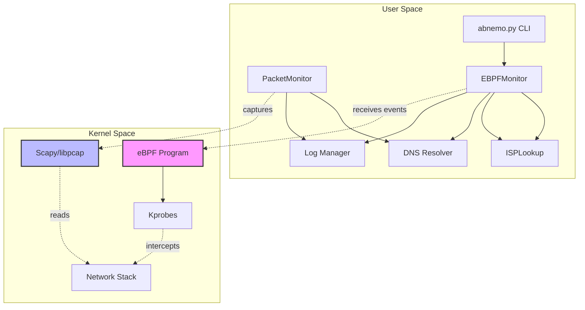

### Component Diagram

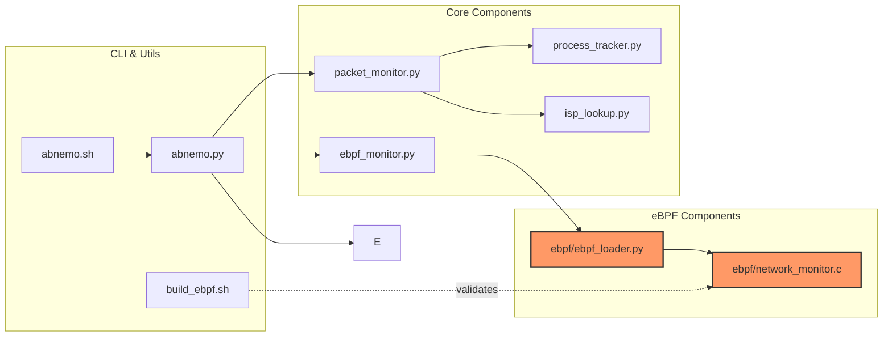

---

## eBPF Mode Deep Dive

### eBPF Program Lifecycle

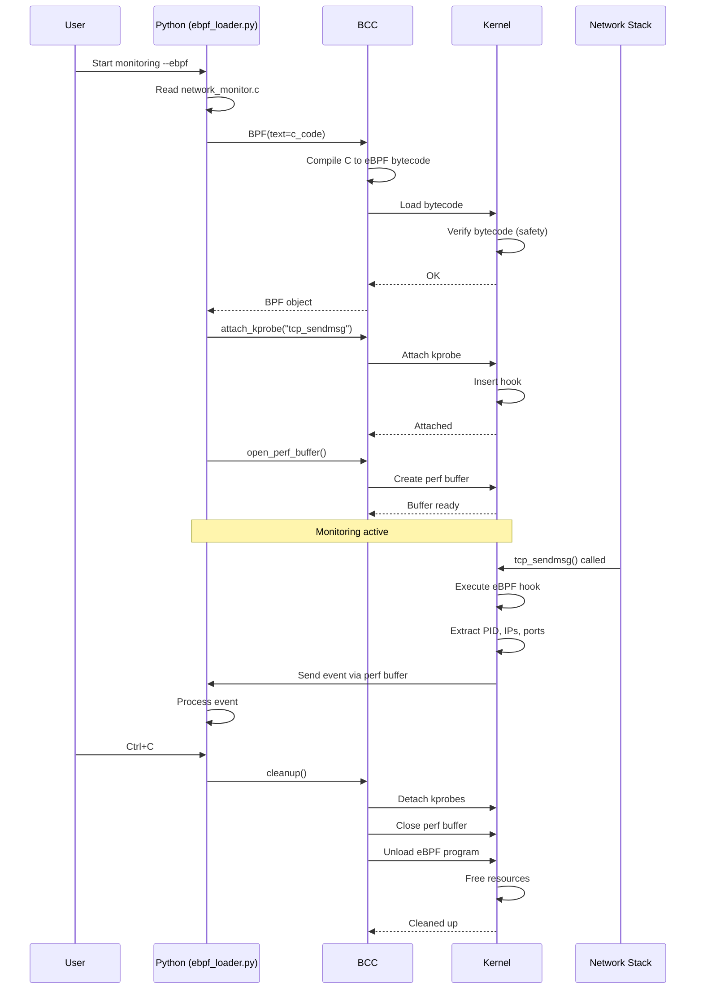

### eBPF Event Flow

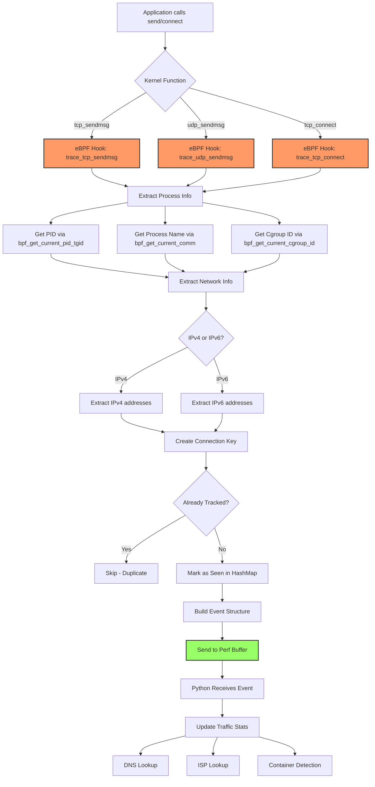

### eBPF Memory Layout

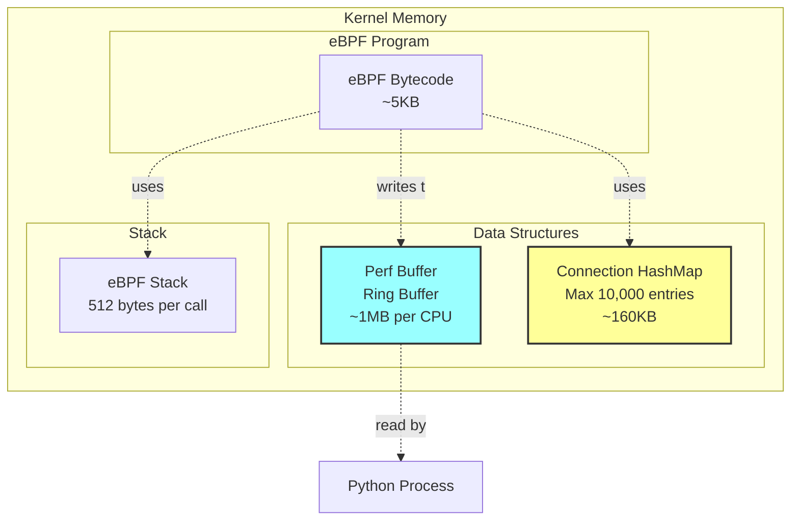

---

## Data Flow

### Complete Monitoring Flow (eBPF Mode)

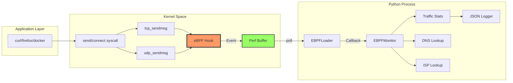

### Thread Architecture

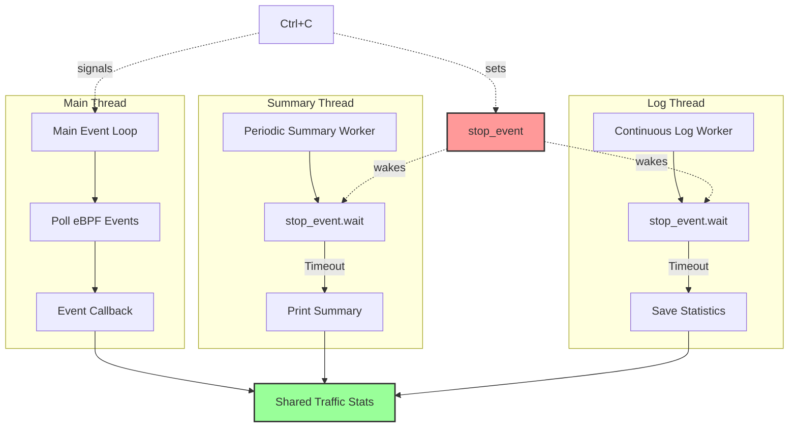

---

## Security Considerations

### Threat Model

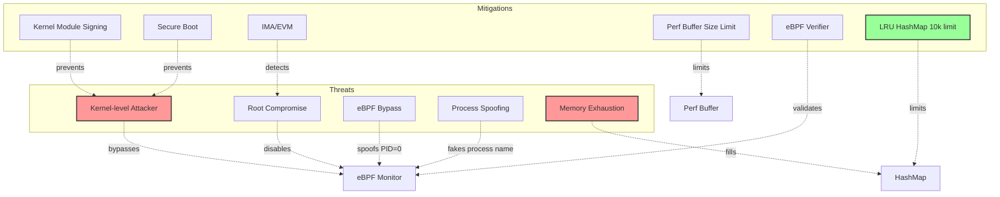

### Security Layers

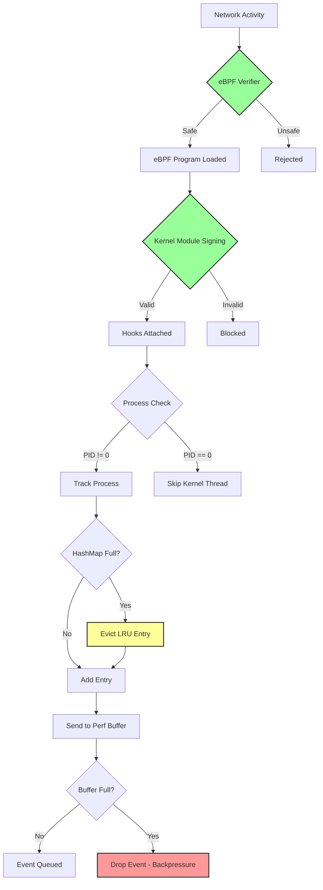

---

## Performance Analysis

### CPU Overhead Comparison

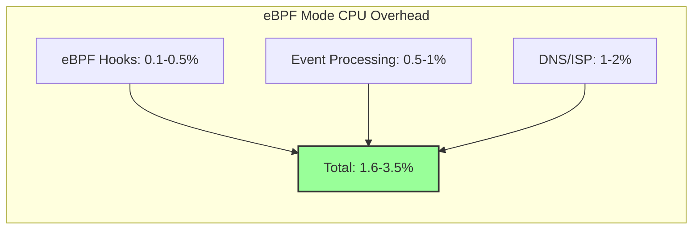

### Latency Analysis

```mermaid
gantt
    title Packet Processing Latency (eBPF Mode)
    dateFormat X
    axisFormat %L ms
    
    section eBPF Mode
    eBPF Hook          :0, 0.1
    Event to Userspace :0.1, 0.5
    DNS Lookup         :0.5, 20
    ISP Lookup         :20, 45
    Total              :0, 45
```

### Memory Usage

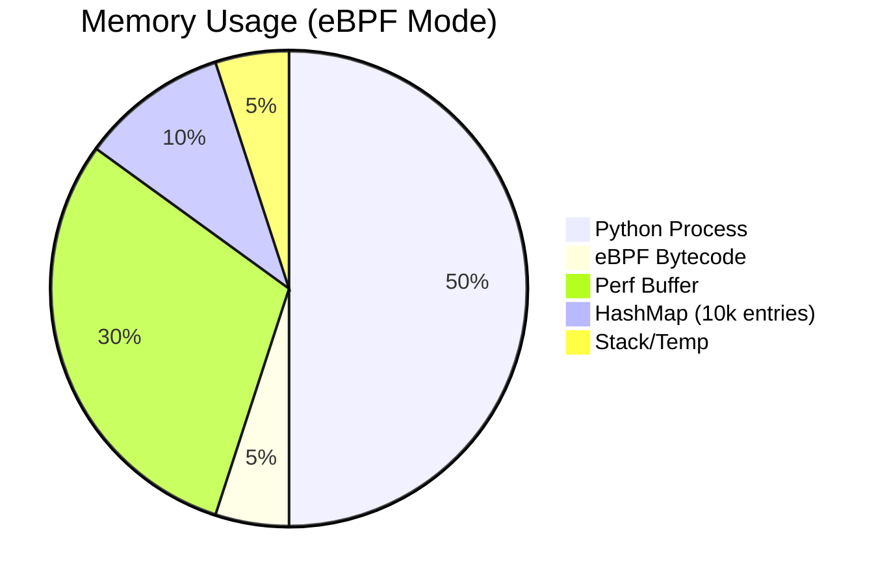

---

## Memory Management

### HashMap Lifecycle (eBPF)

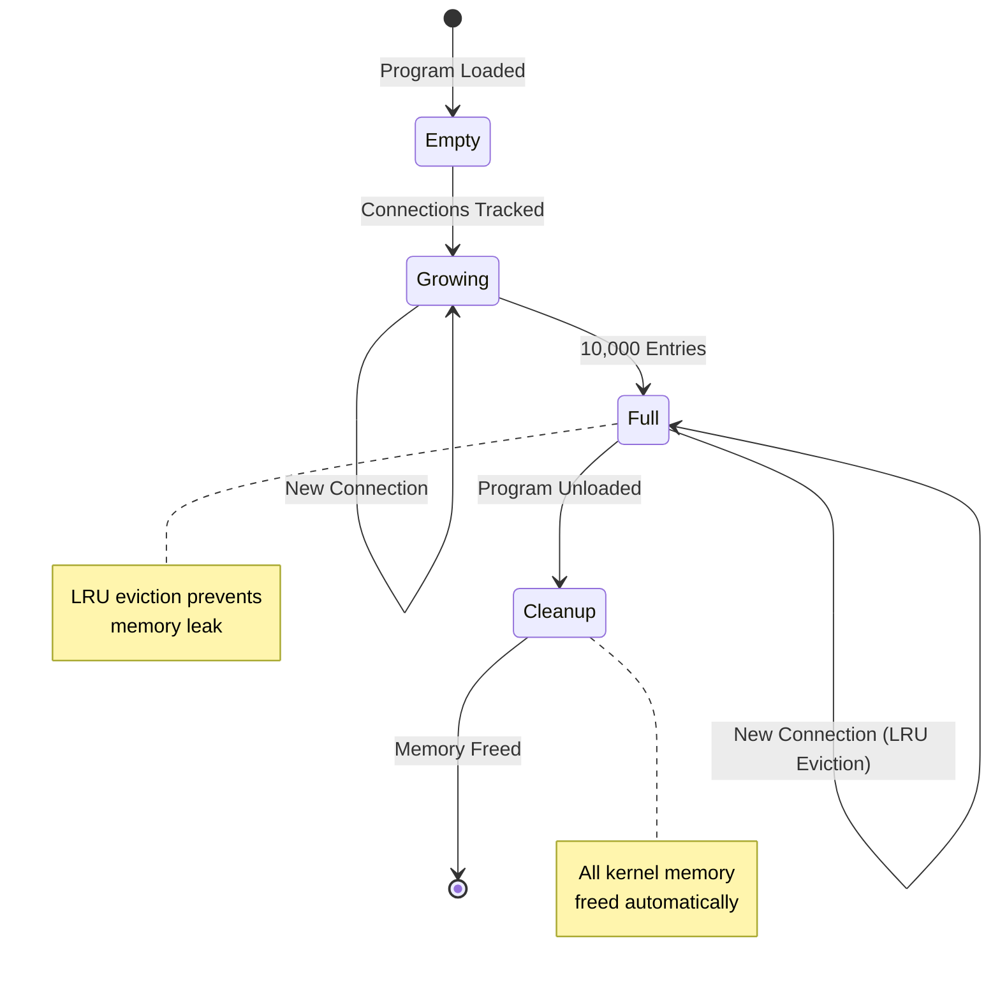

### Perf Buffer Management

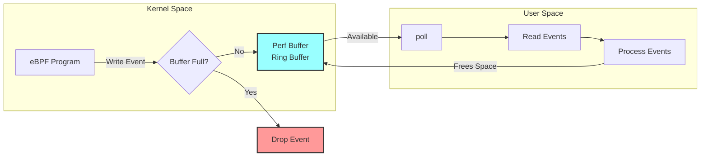

### Resource Cleanup on Exit

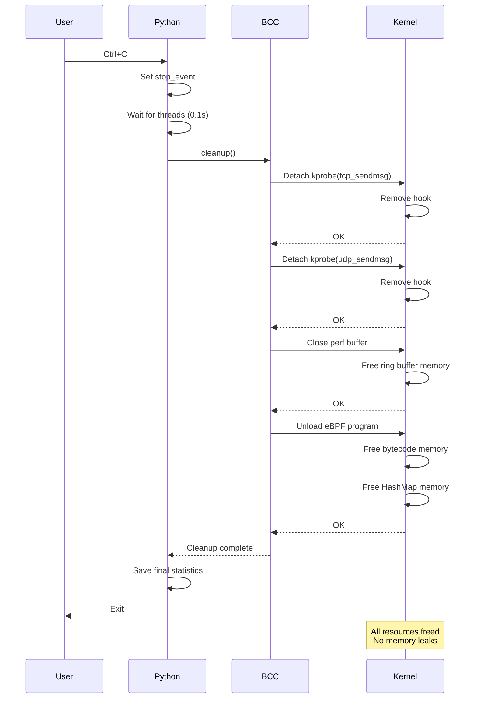

---

## Configuration & Tuning

### HashMap Size Tuning

The HashMap size (10,000 entries) can be adjusted based on your needs:

| Connections/sec | Recommended Size | Memory Usage |
|----------------|------------------|--------------|
| < 100 | 1,000 | ~16 KB |
| 100-1,000 | 10,000 | ~160 KB |
| 1,000-10,000 | 50,000 | ~800 KB |
| > 10,000 | 100,000 | ~1.6 MB |

**Trade-offs:**
- Larger = More memory, fewer duplicate events
- Smaller = Less memory, more duplicate events (but still caught)

### Perf Buffer Size

Default: 1 MB per CPU core

Adjust in `ebpf_loader.py`:
```python
self.bpf["events"].open_perf_buffer(self._handle_event, page_cnt=256)
# page_cnt * 4KB = buffer size
# 256 * 4KB = 1MB
```

---

## Conclusion

Abnemo uses eBPF (Extended Berkeley Packet Filter) for production-ready, security-focused network monitoring.

**Key Features:**
- ✅ **Catches ALL processes**, even short-lived ones
- ✅ **Low overhead** - 1.6-3.5% CPU usage
- ✅ **Complete visibility** - 100% detection rate for all network activity
- ✅ **Direct container tracking** - identifies Docker containers via cgroup
- ✅ **IPv6 support** - full support for IPv4 and IPv6
- ✅ **Real-time monitoring** - immediate process identification

The eBPF implementation uses kernel-level hooks with proper resource management (LRU HashMap, bounded perf buffer) to prevent memory leaks while maintaining high performance and complete visibility into network activity.
