# Abnemo Design Document

Comprehensive architecture and design documentation for the Abnemo network traffic monitoring and security system.

---

## Table of Contents

1. [System Overview](#system-overview)
2. [Architecture](#architecture)
3. [Core Components](#core-components)
4. [Data Flow](#data-flow)
5. [eBPF Monitoring System](#ebpf-monitoring-system)
6. [IPTables Integration](#iptables-integration)
7. [Web Server & API](#web-server--api)
8. [Security & Authentication](#security--authentication)
9. [Data Storage](#data-storage)
10. [Technology Stack](#technology-stack)

---

## System Overview

Abnemo is a Linux-based network traffic monitoring and security tool that provides:

- **Kernel-level packet capture** using eBPF for near-zero overhead monitoring
- **Process and container tracking** to identify which applications generate traffic
- **Real-time web dashboard** with OAuth 2.0 authentication
- **IPTables visualization and management** with Docker enrichment
- **Intelligent filtering** with accept-list and warn-list capabilities
- **fail2ban integration** for intrusion prevention visualization

### Key Features

- IPv4 and IPv6 support throughout the stack
- Configurable traffic direction monitoring (outgoing, incoming, bidirectional, all)
- ISP and reverse DNS lookups for network intelligence
- Docker container identification and enrichment
- Automated email alerts for suspicious traffic
- Log rotation with retention policies

---

## Architecture

### High-Level System Architecture

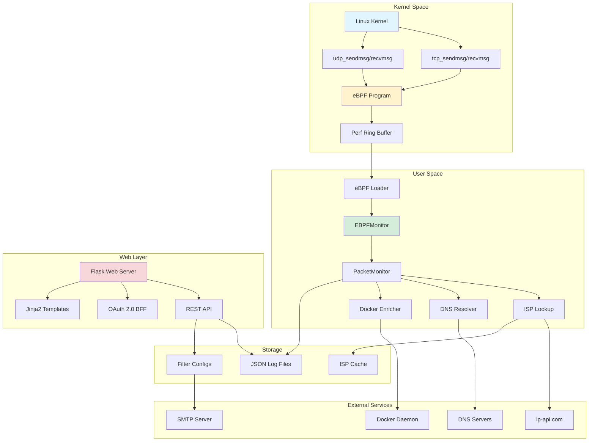

### Component Interaction Flow

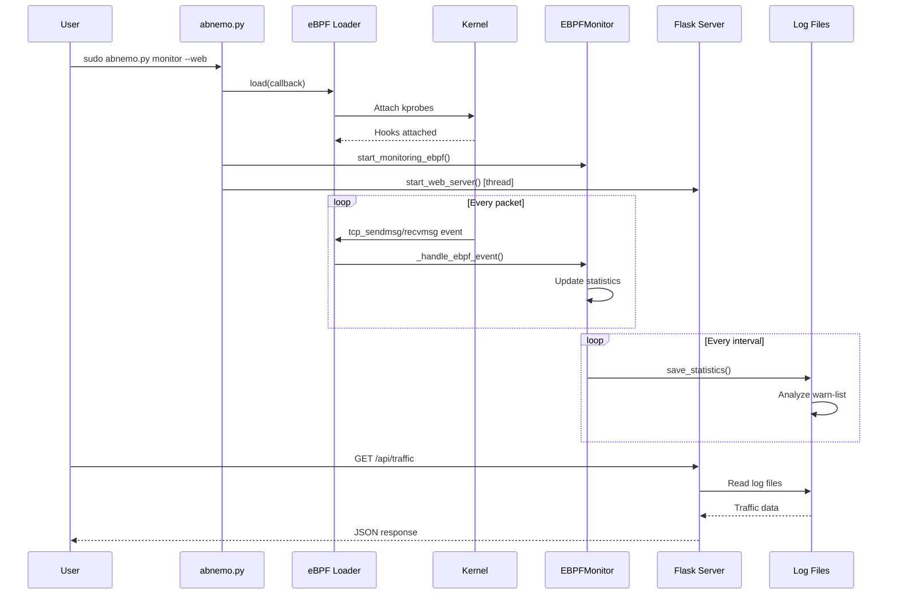

---

## Core Components

### 1. Main CLI (`abnemo.py`)

**Purpose**: Command-line interface and application entry point

**Responsibilities**:
- Parse command-line arguments
- Configure logging levels
- Initialize monitoring components
- Start web server (optional)
- Handle graceful shutdown

**Key Commands**:
- `monitor` - Start network traffic monitoring
- `list-logs` - List captured traffic logs
- `iptables-tree` - Visualize iptables configuration
- `web` - Start standalone web server

### 2. eBPF Monitoring System

#### eBPF Loader (`ebpf/ebpf_loader.py`)

**Purpose**: Load and manage eBPF programs in the kernel

**Key Methods**:
- `load(callback)` - Compile C code to eBPF bytecode and attach to kernel
- `poll(timeout)` - Poll perf buffer for events
- `cleanup()` - Detach hooks and free resources

**Kernel Hooks**:
- `tcp_sendmsg` / `tcp_recvmsg` - TCP traffic
- `udp_sendmsg` / `udp_recvmsg` - UDP traffic

#### eBPF Monitor (`src/ebpf_monitor.py`)

**Purpose**: User-space component that receives and processes eBPF events

**Inheritance**: Extends `PacketMonitor` base class

**Key Features**:
- Process identification via PID and cgroup ID
- Container detection from cgroup paths
- Docker container name resolution
- Actual byte counting from kernel events

**Container Identification Methods**:
1. cgroup ID matching (primary)
2. PID-based cgroup parsing (fallback)
3. Docker inspect API calls (name resolution)

### 3. Packet Monitor (`src/packet_monitor.py`)

**Purpose**: Base class for network traffic monitoring and statistics

**Key Responsibilities**:
- Traffic statistics aggregation by IP
- Reverse DNS lookups with caching
- IP address classification (public, private, multicast, etc.)
- ISP information enrichment
- Traffic direction filtering
- Log rotation and retention

**Traffic Direction Modes**:
- `outgoing` - Only local → remote (default)
- `incoming` - Only unsolicited remote → local
- `bidirectional` - Responses to outgoing connections
- `all` - Everything including unsolicited incoming

**Statistics Tracked Per IP**:
- Bytes and packet counts
- Domain names (reverse DNS)
- Ports accessed
- IP type classification
- ISP information
- Associated processes/containers

### 4. ISP Lookup (`src/isp_lookup.py`)

**Purpose**: Retrieve ISP and geolocation data for IP addresses

**Features**:
- Persistent JSON cache with TTL
- Rate limiting (1.5s for free tier, 0.1s for pro)
- Multi-instance cache synchronization
- Automatic cache expiration

**API Integration**:
- Free tier: `http://ip-api.com/json/`
- Pro tier: `https://pro.ip-api.com/json/` (requires API key)

**Cached Data**:
- ISP name and organization
- AS number and name
- Country and country code
- Timestamp for TTL management

---

## Data Flow

### Packet Capture and Processing Flow

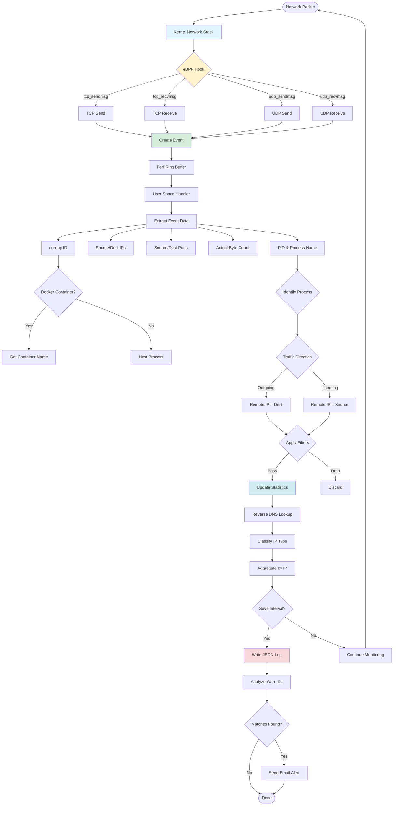

### Web Request Flow

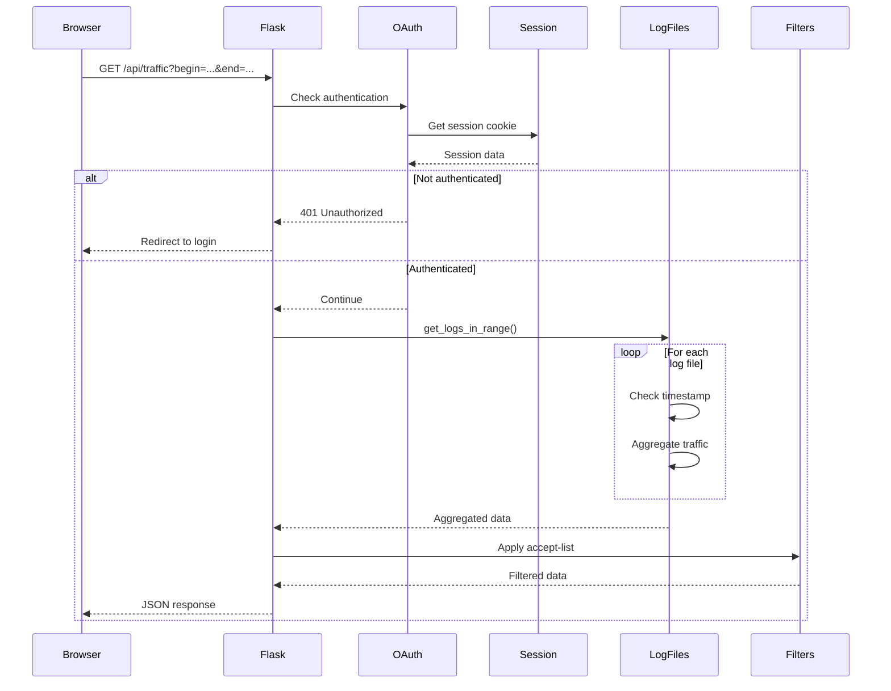

---

## eBPF Monitoring System

### eBPF Program Architecture

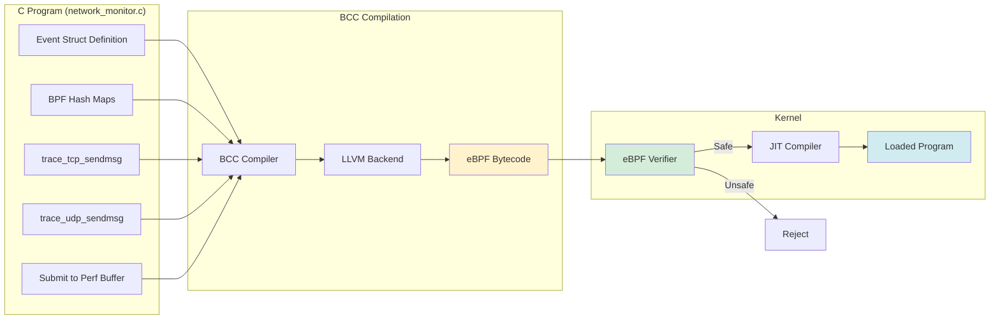

### Event Structure

The eBPF program captures the following data for each network event:

```c
struct traffic_event_t {
    u32 pid;              // Process ID
    char comm[16];        // Process name
    u32 saddr;            // Source IP (IPv4)
    u32 daddr;            // Destination IP (IPv4)
    u32 saddr_v6[4];      // Source IP (IPv6)
    u32 daddr_v6[4];      // Destination IP (IPv6)
    u16 sport;            // Source port
    u16 dport;            // Destination port
    u8 protocol;          // 6=TCP, 17=UDP
    u64 cgroup_id;        // Container cgroup ID
    u8 ip_version;        // 4 or 6
    u32 bytes;            // Actual bytes sent/received
};
```

### Container Identification Process

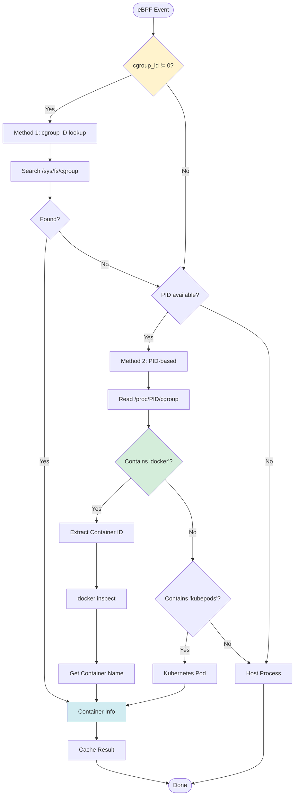

---

## IPTables Integration

### IPTables Model Architecture

```mermaid
classDiagram
    class IptablesConfig {
        +Dict~str,Table~ tables
        +add_table(table)
        +get_table(name)
        +get_all_chains()
        +total_rules: int
    }
    
    class Table {
        +str name
        +Dict~str,Chain~ chains
        +add_chain(chain)
        +get_chain(name)
        +get_docker_chains()
        +total_rules: int
    }
    
    class Chain {
        +str name
        +Policy policy
        +int packet_count
        +int byte_count
        +List~Rule~ rules
        +is_builtin: bool
        +is_docker_chain: bool
        +docker_rules_count: int
        +add_rule(rule)
        +get_docker_rules()
    }
    
    class Rule {
        +int pkts
        +int bytes
        +str target
        +str prot
        +DockerEnrichedField in_interface
        +DockerEnrichedField out_interface
        +DockerEnrichedField source
        +DockerEnrichedField destination
        +str extra
        +is_docker_related: bool
        +is_chain_target: bool
        +get_flow_description()
    }
    
    class DockerEnrichedField {
        +str original
        +Dict docker_info
        +is_docker_related: bool
        +docker_name: str
        +docker_type: str
        +label: str
    }
    
    class DockerEnricher {
        +Dict containers
        +Dict networks
        +enrich_ip(ip)
        +enrich_interface(iface)
        +is_docker_interface(iface)
        +get_docker_flow_info(rule)
    }
    
    IptablesConfig "1" *-- "*" Table
    Table "1" *-- "*" Chain
    Chain "1" *-- "*" Rule
    Rule "1" *-- "4" DockerEnrichedField
    DockerEnrichedField ..> DockerEnricher : enriched by
```

### IPTables Parsing Flow

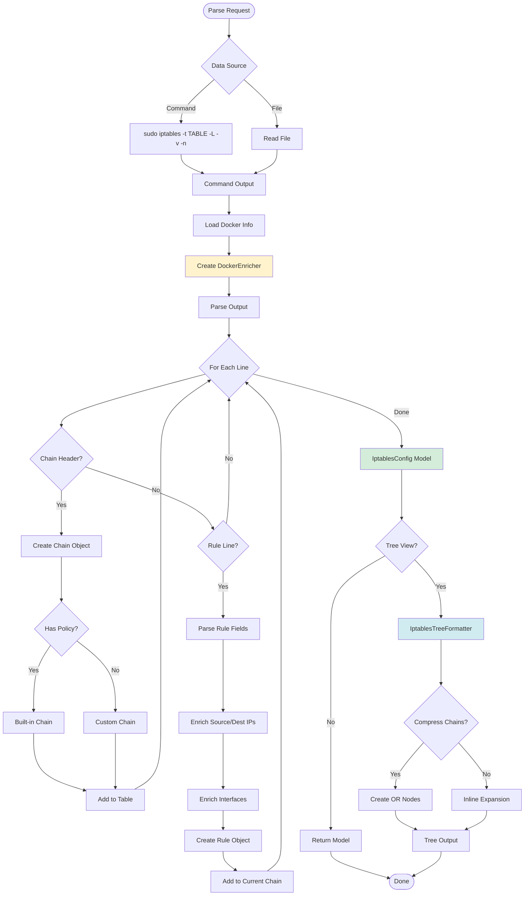

---

## Web Server & API

### Flask Application Structure

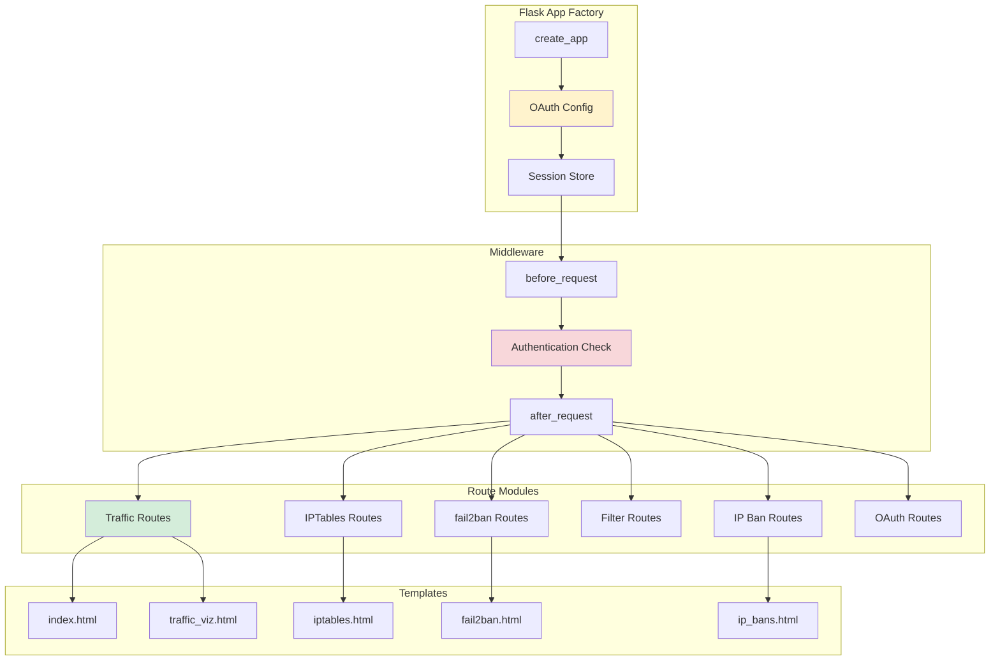

### API Endpoints

#### Traffic Monitoring
- `GET /api/traffic` - Get aggregated traffic data for time range
- `GET /api/traffic-viz` - Get time series data with regex filtering
- `GET /api/process/<pid>` - Get process details via ps command

#### IPTables Management
- `GET /api/iptables/visualize` - Get iptables tree visualization
- `GET /api/iptables/tables` - List all iptables tables
- `GET /api/iptables/chains` - Get chains for a table

#### fail2ban Integration
- `GET /api/fail2ban/status` - Get fail2ban status
- `GET /api/fail2ban/visualize` - Get Mermaid diagram

#### Filter Management
- `GET /api/accept-list-filters` - List accept-list filters
- `POST /api/accept-list-filters` - Create accept-list filter
- `PUT /api/accept-list-filters/<id>` - Update filter
- `DELETE /api/accept-list-filters/<id>` - Delete filter
- `GET /api/warnlist-filters` - List warn-list filters
- `POST /api/warnlist-filters` - Create warn-list filter
- `PUT /api/warnlist-filters/<id>` - Update filter
- `DELETE /api/warnlist-filters/<id>` - Delete filter

#### IP Ban Management
- `GET /api/ip-bans` - List banned IPs
- `POST /api/ip-bans` - Ban an IP address
- `DELETE /api/ip-bans/<ip>` - Unban an IP address

#### OAuth & User
- `GET /api/user` - Get current user info
- `GET /api/oauth/status` - Get OAuth status
- `POST /api/logout` - Logout current user
- `GET /oauth/login` - Initiate OAuth login
- `GET /oauth/callback` - OAuth callback handler

---

## Security & Authentication

### OAuth 2.0 BFF Pattern

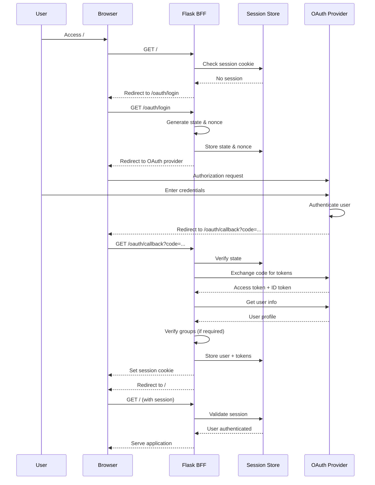

### Filter System

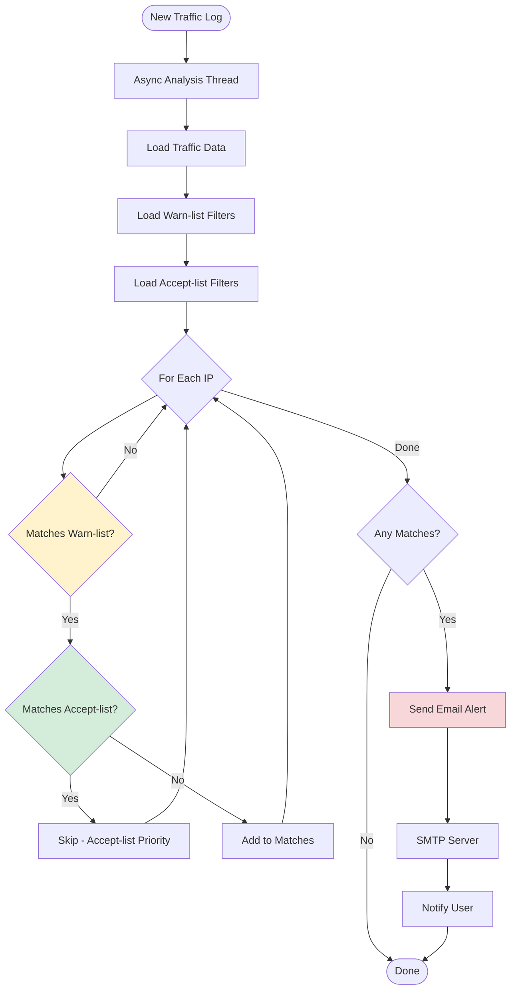

---

## Data Storage

### Log File Structure

**Filename Format**: `traffic_log_YYYYMMDD_HHMMSS.json`

**JSON Structure**:
```json
{
  "timestamp": "2024-03-23T20:55:00.123456",
  "total_ips": 42,
  "total_bytes": 1234567890,
  "total_packets": 98765,
  "traffic_by_ip": {
    "8.8.8.8": {
      "bytes": 123456,
      "packets": 234,
      "domains": ["dns.google"],
      "ports": [53, 443],
      "ip_type": "public",
      "isp": {
        "org": "Google LLC",
        "country_code": "US",
        "as": "AS15169"
      },
      "processes": [
        {
          "name": "firefox",
          "pid": 1234,
          "container": {
            "name": "web-app",
            "id": "abc123def456"
          }
        }
      ]
    }
  }
}
```

---

## Technology Stack

### Core Technologies

| Component | Technology | Purpose |
|-----------|-----------|----------|
| **Kernel Monitoring** | eBPF/BCC | Kernel-level packet capture |
| **Language** | Python 3.7+ | Application logic |
| **Web Framework** | Flask | REST API and web server |
| **Templating** | Jinja2 | HTML template rendering |
| **Packet Processing** | Scapy | Alternative packet capture |
| **DNS** | dnspython | Reverse DNS lookups |
| **Container** | Docker API | Container identification |
| **Authentication** | OAuth 2.0 | User authentication |
| **Visualization** | Mermaid.js | Diagram generation |

### Python Dependencies

**Core**:
- `bcc` / `python3-bpfcc` - BPF Compiler Collection
- `scapy` - Packet manipulation library
- `dnspython` - DNS toolkit
- `flask` - Web framework
- `flask-wtf` - CSRF protection
- `flask-limiter` - Rate limiting
- `watchdog` - File system monitoring
- `cryptography` - Security utilities
- `tabulate` - Table formatting
- `debugpy` - Remote debugging

---

## Conclusion

Abnemo provides a comprehensive network monitoring solution that combines:

- **Low-overhead monitoring** via eBPF kernel hooks
- **Rich context** through process, container, and ISP identification
- **Flexible filtering** with accept-list and warn-list capabilities
- **Secure access** via OAuth 2.0 authentication
- **Visual insights** through iptables and fail2ban integration

The modular architecture allows for easy extension and customization while maintaining performance and security.
