# Security Check Measures - CSRF Protection Implementation

**Date**: March 24, 2026  
**Related Audit**: `docs/ephemeral/SECURITY_CHECK.md`  
**Issue Fixed**: Issue #1 - NO CSRF PROTECTION ON STATE-CHANGING ENDPOINTS

---

## Executive Summary

This document describes the implementation of CSRF (Cross-Site Request Forgery) protection to address **Issue #1** from the security audit. The fix prevents attackers from performing unauthorized actions on behalf of authenticated users.

---

## Issue Description

### Original Vulnerability

**Severity**: 🔴 CRITICAL  
**Location**: All POST endpoints (`/api/logout`, `/api/accept-list-filters`, `/api/warnlist-filters`, `/api/ip-bans`, `/api/fail2ban/visualize/custom`)

The application had **NO CSRF token validation** on state-changing endpoints. An attacker could craft a malicious link or embed a form on their website to perform actions on behalf of authenticated users.

### Attack Scenario (Before Fix)

```html
<!-- Attacker's website -->

<!-- OR -->
<form action="https://victim-abnemo.com/api/logout" method="POST" id="evil">
<script>document.getElementById('evil').submit();</script>
```

When a logged-in user visited the attacker's page, they would be automatically logged out or have other state-changing actions performed without their consent.

---

## How CSRF Protection Works

The following diagram illustrates the **Synchronizer Token Pattern** used to prevent CSRF attacks:

```mermaid
sequenceDiagram
    participant Attacker
    participant User Browser
    participant Abnemo Server
    
    Note over Abnemo Server: User logs in and<br/>session is created
    
    rect rgb(200, 240, 200)
        Note right of User Browser: ✅ LEGITIMATE REQUEST
        User Browser->>Abnemo Server: GET /dashboard
        Abnemo Server->>Abnemo Server: Generate CSRF token<br/>tied to session
        Abnemo Server->>User Browser: HTML with<br/><meta name="csrf-token" content="abc123">
        User Browser->>User Browser: JavaScript reads token<br/>from meta tag
        User Browser->>Abnemo Server: POST /api/logout<br/>X-CSRF-Token: abc123
        Abnemo Server->>Abnemo Server: Validate token matches session
        Abnemo Server->>User Browser: ✅ Success: Logged out
    end
    
    rect rgb(255, 200, 200)
        Note right of Attacker: ❌ CSRF ATTACK BLOCKED
        Attacker->>Attacker: Create malicious page with<br/><form action="abnemo.com/api/logout">
        User Browser->>Attacker: Visit attacker's website
        Attacker->>User Browser: Serve malicious HTML
        User Browser->>Abnemo Server: POST /api/logout<br/>(NO CSRF TOKEN)
        Abnemo Server->>Abnemo Server: No token found in request
        Abnemo Server->>User Browser: ❌ 403 Forbidden:<br/>CSRF token missing
    end
    
    rect rgb(255, 220, 200)
        Note right of Attacker: ❌ TOKEN FORGERY BLOCKED
        Attacker->>User Browser: POST /api/logout<br/>X-CSRF-Token: forged_token
        User Browser->>Abnemo Server: POST /api/logout<br/>X-CSRF-Token: forged_token
        Abnemo Server->>Abnemo Server: Validate token<br/>(signature invalid)
        Abnemo Server->>User Browser: ❌ 403 Forbidden:<br/>CSRF validation failed
    end
```



**Key Protection Mechanisms:**
1. **Token Generation**: Server generates cryptographically secure token tied to user session
2. **Token Embedding**: Token rendered in HTML meta tag (not accessible to attacker's site)
3. **Token Validation**: Server validates token signature and session binding on every state-changing request
4. **Same-Origin Policy**: Attacker cannot read token from victim's page due to browser security

---

## Implementation Details

### 1. Added Flask-WTF Dependency

**File**: `requirements.txt`

```python
flask-wtf>=1.2.0
```

Flask-WTF provides industry-standard CSRF protection for Flask applications using secure token generation and validation.

### 2. Configured CSRF Protection

**File**: `src/web_server.py`

Added CSRF protection initialization in the `create_app()` function:

```python
from flask_wtf.csrf import CSRFProtect, generate_csrf, CSRFError

# Configure CSRF protection
app.config['SECRET_KEY'] = os.environ.get('FLASK_SECRET_KEY', os.urandom(32).hex())
app.config['WTF_CSRF_CHECK_DEFAULT'] = False  # Manual validation on POST endpoints
app.config['WTF_CSRF_TIME_LIMIT'] = None  # No time limit for CSRF tokens
csrf = CSRFProtect(app)
```

**Configuration Notes**:
- `SECRET_KEY`: Uses environment variable `FLASK_SECRET_KEY` if available, otherwise generates a random key
- `WTF_CSRF_CHECK_DEFAULT = False`: We manually validate CSRF tokens on each POST endpoint for explicit control
- `WTF_CSRF_TIME_LIMIT = None`: Tokens don't expire (can be adjusted based on security requirements)

### 3. Render CSRF Token in HTML (Synchronizer Token Pattern)

**File**: `templates/base.html`

Following **industry best practices** (OWASP and Flask-WTF recommendations), the CSRF token is rendered directly in the HTML as a meta tag:

```html
<head>
    <meta charset="UTF-8">
    <meta name="viewport" content="width=device-width, initial-scale=1.0">
    <meta name="csrf-token" content="{{ csrf_token() }}">
    <title>Abnemo - Network Monitor</title>
    ...
</head>
```

This is the **Synchronizer Token Pattern** - the recommended approach where:
- Token is generated server-side and embedded in the page
- JavaScript reads the token from the DOM (not via AJAX)
- Token is tied to the user's session
- No separate API endpoint needed

### 4. Added CSRF Error Handler

**File**: `src/web_server.py`

```python
@app.errorhandler(CSRFError)
def handle_csrf_error(e):
    return jsonify({
        'error': 'CSRF token validation failed',
        'code': 'csrf_error',
        'reason': e.description
    }), 403
```

Provides consistent error responses for CSRF validation failures.

### 5. Protected All State-Changing Endpoints

Updated **all POST, PUT, and DELETE endpoints** to require CSRF token validation:

#### `/api/logout` (oauth.py)

```python
@app.route('/api/logout', methods=['POST'])
def api_logout():
    """Clear authentication session."""
    # Validate CSRF token
    try:
        csrf_token = request.headers.get('X-CSRF-Token') or request.form.get('csrf_token')
        if not csrf_token:
            return jsonify({
                'error': 'CSRF token missing',
                'code': 'csrf_token_missing'
            }), 403
        validate_csrf(csrf_token)
    except (BadRequest, Exception) as e:
        return jsonify({
            'error': 'CSRF token validation failed',
            'code': 'csrf_error',
            'reason': str(e)
        }), 403
    
    # ... rest of logout logic
```

#### `/api/accept-list-filters` and `/api/warnlist-filters` (filters.py)

Added helper function and validation:

```python
def _validate_csrf_token():
    """Validate CSRF token from request headers or form data."""
    try:
        csrf_token = request.headers.get('X-CSRF-Token') or request.form.get('csrf_token')
        if not csrf_token:
            return False, ({'error': 'CSRF token missing', 'code': 'csrf_token_missing'}, 403)
        validate_csrf(csrf_token)
        return True, None
    except (BadRequest, Exception) as e:
        return False, ({'error': 'CSRF token validation failed', 'code': 'csrf_error', 'reason': str(e)}, 403)

@app.route('/api/accept-list-filters', methods=['POST'])
def api_create_accept_list_filter():
    """Create a new accept-list filter"""
    # Validate CSRF token
    csrf_valid, csrf_error = _validate_csrf_token()
    if not csrf_valid:
        return jsonify(csrf_error[0]), csrf_error[1]
    # ... rest of logic
```

#### `/api/ip-bans` (ip_bans.py)

```python
@app.route('/api/ip-bans', methods=['POST'])
def api_ban_ip():
    """Ban an IP address"""
    # Validate CSRF token
    try:
        csrf_token = request.headers.get('X-CSRF-Token') or request.form.get('csrf_token')
        if not csrf_token:
            return jsonify({'error': 'CSRF token missing', 'code': 'csrf_token_missing'}), 403
        validate_csrf(csrf_token)
    except (BadRequest, Exception) as e:
        return jsonify({'error': 'CSRF token validation failed', 'code': 'csrf_error', 'reason': str(e)}), 403
    # ... rest of logic
```

#### `/api/fail2ban/visualize/custom` POST (fail2ban_endpoints.py)

```python
@app.route('/api/fail2ban/visualize/custom', methods=['POST'])
def api_fail2ban_visualize_custom():
    """API endpoint to visualize custom fail2ban config from user input"""
    # Validate CSRF token
    try:
        csrf_token = request.headers.get('X-CSRF-Token') or request.form.get('csrf_token')
        if not csrf_token:
            return jsonify({'error': 'CSRF token missing', 'code': 'csrf_token_missing'}), 403
        validate_csrf(csrf_token)
    except (BadRequest, Exception) as e:
        return jsonify({'error': 'CSRF token validation failed', 'code': 'csrf_error', 'reason': str(e)}), 403
    # ... rest of logic
```

#### PUT and DELETE Endpoints (filters.py)

All filter update and delete endpoints:
- `/api/accept-list-filters/<filter_id>` PUT
- `/api/accept-list-filters/<filter_id>` DELETE
- `/api/warnlist-filters/<filter_id>` PUT
- `/api/warnlist-filters/<filter_id>` DELETE

```python
@app.route('/api/accept-list-filters/<filter_id>', methods=['PUT'])
def api_update_accept_list_filter(filter_id):
    """Update an existing accept-list filter"""
    # Validate CSRF token
    csrf_valid, csrf_error = _validate_csrf_token()
    if not csrf_valid:
        return jsonify(csrf_error[0]), csrf_error[1]
    # ... rest of logic
```

#### DELETE Endpoint (ip_bans.py)

- `/api/ip-bans/<ip_address>` DELETE

```python
@app.route('/api/ip-bans/<ip_address>', methods=['DELETE'])
def api_unban_ip(ip_address):
    """Unban an IP address"""
    # Validate CSRF token
    try:
        csrf_token = request.headers.get('X-CSRF-Token') or request.form.get('csrf_token')
        if not csrf_token:
            return jsonify({'error': 'CSRF token missing', 'code': 'csrf_token_missing'}), 403
        validate_csrf(csrf_token)
    except (BadRequest, Exception) as e:
        return jsonify({'error': 'CSRF token validation failed', 'code': 'csrf_error', 'reason': str(e)}), 403
    # ... rest of logic
```

### 4. Frontend Integration

**File**: `templates/base.html`

JavaScript reads the CSRF token from the meta tag (industry standard):

```javascript
// CSRF token management - read from meta tag (industry standard)
function getCsrfToken() {
    const meta = document.querySelector('meta[name="csrf-token"]');
    return meta ? meta.getAttribute('content') : null;
}

async function logout() {
    if (!authState.oauth_enabled) {
        return;
    }
    try {
        const token = getCsrfToken();
        await fetch('/api/logout', { 
            method: 'POST',
            headers: {
                'X-CSRF-Token': token
            }
        });
    } catch (error) {
        console.warn('Logout failed', error);
    }
    // ...
}
```

The `getCsrfToken()` function:
- Reads token from DOM (no AJAX request)
- Returns immediately (synchronous)
- Available globally in all templates
- Follows OWASP and Flask-WTF best practices

### 5. Installation Script Integration

**File**: `install.sh`

The installation script now automatically generates a secure `FLASK_SECRET_KEY`:

```bash
echo -e "${GREEN}=== Security Configuration ===${NC}"
echo -e "${YELLOW}Generating FLASK_SECRET_KEY for CSRF protection...${NC}"
FLASK_SECRET_KEY=$(openssl rand -hex 32)
echo -e "${GREEN}✓ Generated secure secret key${NC}"
```

The key is automatically added to `/etc/abnemo/abnemo.env` during installation.

### 6. Documentation

**File**: `README.md`

Added a new "CSRF Protection" section with instructions for generating and setting `FLASK_SECRET_KEY`:

```bash
# Generate a secure secret key (recommended for production)
export FLASK_SECRET_KEY=$(openssl rand -hex 32)

# Or add to ~/.bashrc for persistence
echo "export FLASK_SECRET_KEY=$(openssl rand -hex 32)" >> ~/.bashrc
```

---

## How to Use CSRF Protection

### For API Clients

**Important**: CSRF tokens are rendered in HTML pages and are session-specific. For API-only clients (no browser), you should:

1. **First, load any HTML page** to get the token from the meta tag
2. **Extract the token** from `<meta name="csrf-token" content="...">`
3. **Include the token in state-changing requests**:
   
   **Option A: HTTP Header (Recommended)**
   ```bash
   curl -X POST https://abnemo.example.com/api/logout \
     -H "X-CSRF-Token: ImY3ZjE4OTk5ZTg1NjQ3YzI4ZjU4..." \
     -H "Content-Type: application/json"
   ```

   **Option B: Form Data**
   ```bash
   curl -X POST https://abnemo.example.com/api/logout \
     -d "csrf_token=ImY3ZjE4OTk5ZTg1NjQ3YzI4ZjU4..."
   ```

### For JavaScript/Frontend Applications

The base template (`templates/base.html`) includes a global `getCsrfToken()` function that reads from the meta tag:

```javascript
// Get CSRF token from meta tag (synchronizer token pattern)
const token = getCsrfToken();

// Use token in POST request
const response = await fetch('/api/logout', {
  method: 'POST',
  headers: {
    'X-CSRF-Token': token
  }
});

// Works for PUT and DELETE too
const updateResponse = await fetch('/api/accept-list-filters/123', {
  method: 'PUT',
  headers: {
    'X-CSRF-Token': token,
    'Content-Type': 'application/json'
  },
  body: JSON.stringify({ pattern: '192.168.1.1', description: 'Updated' })
});
```

**Why this approach?**
- ✅ **Industry standard** (OWASP Synchronizer Token Pattern)
- ✅ **Flask-WTF recommended** approach
- ✅ **No extra API calls** - token embedded in page
- ✅ **Session-bound** - token tied to user session
- ✅ **Simple and secure** - widely adopted pattern

---

## Testing

### Automated Tests

**File**: `tests/test_csrf_protection.py`

Comprehensive test suite that verifies:
- ✅ CSRF token is available in test context (rendered in HTML)
- ✅ POST endpoints reject requests without CSRF tokens
- ✅ POST endpoints reject requests with invalid CSRF tokens
- ✅ POST endpoints accept requests with valid CSRF tokens
- ✅ PUT endpoints require CSRF tokens
- ✅ DELETE endpoints require CSRF tokens
- ✅ CSRF tokens can be provided via header or form data
- ✅ Attack scenarios are prevented

### Running Tests

```bash
# Run CSRF protection tests
pytest tests/test_csrf_protection.py -v

# Run all tests
pytest tests/ -v
```

### Manual Testing

1. **Test without CSRF token** (should fail):
   ```bash
   curl -X POST http://localhost:5000/api/logout
   ```
   Expected response:
   ```json
   {"error": "CSRF token missing", "code": "csrf_token_missing"}
   ```

2. **Test with invalid CSRF token** (should fail):
   ```bash
   curl -X POST http://localhost:5000/api/logout \
     -H "X-CSRF-Token: invalid_token"
   ```
   Expected response:
   ```json
   {"error": "CSRF token validation failed", "code": "csrf_error", "reason": "..."}
   ```

3. **Test with valid CSRF token** (should succeed):
   ```bash
   # Get token from HTML page
   TOKEN=$(curl -s http://localhost:5000/ | grep -oP 'csrf-token" content="\K[^"]+')
   
   # Use token
   curl -X POST http://localhost:5000/api/logout \
     -H "X-CSRF-Token: $TOKEN"
   ```
   Expected response:
   ```json
   {"success": true}
   ```

---

## Security Benefits

### Attack Prevention

✅ **CSRF Logout Attack**: Prevented - attackers cannot force users to logout  
✅ **CSRF Filter Creation**: Prevented - attackers cannot create malicious filters  
✅ **CSRF Filter Modification**: Prevented - attackers cannot update existing filters  
✅ **CSRF Filter Deletion**: Prevented - attackers cannot delete filters  
✅ **CSRF IP Banning**: Prevented - attackers cannot ban arbitrary IPs  
✅ **CSRF IP Unbanning**: Prevented - attackers cannot unban IPs  
✅ **CSRF Configuration Changes**: Prevented - attackers cannot modify fail2ban configs

### Defense in Depth

This implementation provides multiple layers of protection:

1. **Token Generation**: Cryptographically secure random tokens
2. **Token Validation**: Server-side validation using Flask-WTF
3. **Flexible Token Delivery**: Supports both HTTP headers and form data
4. **Consistent Error Handling**: Clear error messages for debugging
5. **Test Coverage**: Comprehensive test suite ensures protection remains effective

---

## Configuration

### Environment Variables

- `FLASK_SECRET_KEY`: (Optional) Secret key for CSRF token generation
  - If not set, a random key is generated on startup
  - **Production**: Set this to a persistent secret value
  - **Development**: Can be omitted (random key is fine)

Example:
```bash
export FLASK_SECRET_KEY="your-secret-key-here-min-32-chars"
```

### Security Recommendations

1. **Set FLASK_SECRET_KEY in production**: Use a persistent, cryptographically random value
2. **Use HTTPS**: CSRF protection is most effective over HTTPS
3. **Consider token expiration**: Currently tokens don't expire; adjust `WTF_CSRF_TIME_LIMIT` if needed
4. **Monitor failed CSRF attempts**: Log and alert on repeated CSRF failures (potential attack)

---

## Compliance Status

### Before Fix
❌ No CSRF protection on state-changing endpoints  
❌ Vulnerable to CSRF attacks  
❌ Attack scenario: Attacker could logout users, create/update/delete filters, ban/unban IPs  
❌ No frontend integration - tokens not used

### After Fix
✅ CSRF tokens required for all POST, PUT, and DELETE endpoints  
✅ Tokens validated server-side using Flask-WTF  
✅ Frontend automatically fetches and includes tokens  
✅ Installation script generates secure FLASK_SECRET_KEY  
✅ Documentation includes setup instructions  
✅ Attack scenario: Prevented - requests without valid tokens are rejected  
✅ Test coverage: Comprehensive test suite ensures protection remains effective

---

## Related Security Issues

This fix addresses **Issue #1** from the security audit. Other issues from the audit should be addressed separately:

- ⏳ Issue #2: Tokens stored in memory without encryption
- ⏳ Issue #3: Session fixation vulnerability
- ⏳ Issue #4: No HttpOnly flag verification for cookies
- ⏳ Issue #5: JWT tokens not validated
- ⏳ Issue #6: State parameter not bound to session
- ⏳ Issue #7: Missing security headers
- ⏳ Issue #8: No rate limiting on OAuth endpoints

---

## Maintenance

### Updating Flask-WTF

When updating Flask-WTF, verify:
1. CSRF token generation still works
2. Token validation still works
3. All tests pass
4. No breaking changes in API

### Adding New POST Endpoints

When adding new POST, PUT, or DELETE endpoints:
1. Add CSRF token validation at the start of the handler
2. Add test cases in `tests/test_csrf_protection.py`
3. Document the endpoint in API documentation

Example template:
```python
@app.route('/api/new-endpoint', methods=['POST'])
def new_endpoint():
    """New state-changing endpoint"""
    # Validate CSRF token
    try:
        csrf_token = request.headers.get('X-CSRF-Token') or request.form.get('csrf_token')
        if not csrf_token:
            return jsonify({'error': 'CSRF token missing', 'code': 'csrf_token_missing'}), 403
        validate_csrf(csrf_token)
    except (BadRequest, Exception) as e:
        return jsonify({'error': 'CSRF token validation failed', 'code': 'csrf_error', 'reason': str(e)}), 403
    
    # ... rest of logic
```

---

## References

- **Security Audit**: `docs/ephemeral/SECURITY_CHECK.md`
- **Flask-WTF Documentation**: https://flask-wtf.readthedocs.io/
- **OWASP CSRF Prevention**: https://cheatsheetseries.owasp.org/cheatsheets/Cross-Site_Request_Forgery_Prevention_Cheat_Sheet.html
- **Test Suite**: `tests/test_csrf_protection.py`

---

**Status**: ✅ IMPLEMENTED AND TESTED  
**Last Updated**: March 24, 2026
