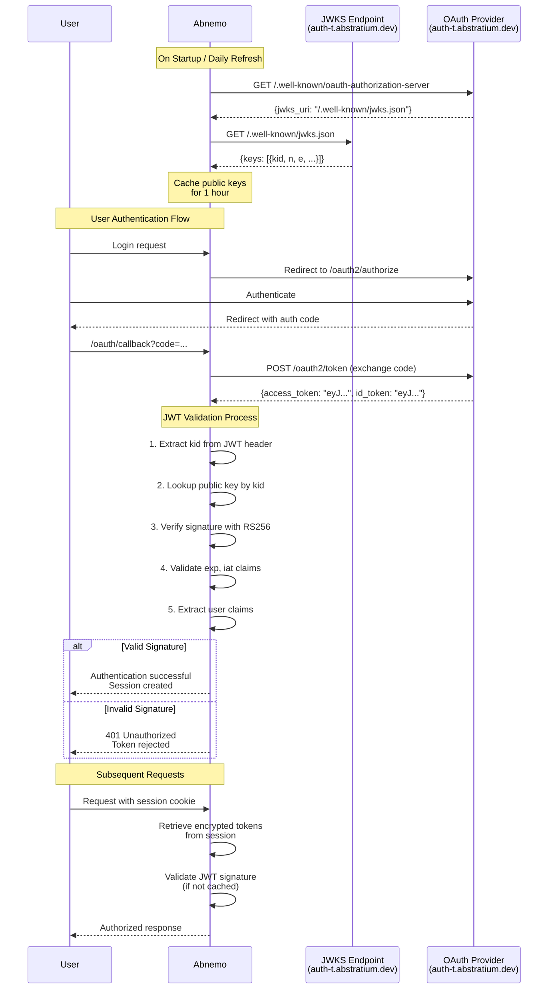

# Security Fix: JWT Token Validation (Issue #5)

**Date**: March 24, 2026  
**Security Issue**: JWT tokens not validated (Issue #5 from SECURITY_CHECK.md)  
**Severity**: 🟡 MEDIUM → ✅ FIXED  
**Implementation**: Industry-standard JWT signature validation using PyJWT with JWKS

---

## Executive Summary

**Problem**: JWT tokens were parsed without signature verification, allowing attackers to forge tokens with arbitrary claims (e.g., admin groups).

**Solution**: Implemented cryptographic signature validation using the OAuth provider's public keys from JWKS endpoint, following OIDC best practices.

**Impact**: Prevents token forgery attacks and ensures only tokens signed by the trusted OAuth provider are accepted.

---

## How JWT Validation Works



---

## Technical Implementation

### 1. JWKS Public Key Fetching

The implementation fetches public keys from the OAuth provider's JWKS endpoint:

```python
# Fetch JWKS URI from well-known endpoint
GET https://auth-t.abstratium.dev/.well-known/oauth-authorization-server
Response: {
    "jwks_uri": "https://auth-t.abstratium.dev/.well-known/jwks.json",
    ...
}

# Fetch public keys from JWKS endpoint
GET https://auth-t.abstratium.dev/.well-known/jwks.json
Response: {
    "keys": [
        {
            "kty": "RSA",
            "use": "sig",
            "kid": "key-id-1",
            "alg": "RS256",
            "n": "modulus...",
            "e": "exponent..."
        }
    ]
}
```

**Key Features**:
- JWKS URI is fetched from the well-known endpoint (configured via `ABSTRAUTH_WELLKNOWN_URI`)
- Public keys are cached for 1 hour to minimize network requests
- JWKS client is refreshed once per day to handle key rotation
- Supports multiple keys for seamless key rotation

### 2. JWT Signature Validation

Every JWT token is validated before trusting its claims:

```python
def _validate_jwt_token(token, oauth_config, verify_exp=True):
    """Validate JWT token signature and claims using JWKS public keys."""
    
    # 1. Get JWKS client (cached)
    jwks_client = _get_jwks_client(oauth_config)
    
    # 2. Extract kid from token header and fetch matching public key
    signing_key = jwks_client.get_signing_key_from_jwt(token)
    
    # 3. Verify signature and decode claims
    decoded = jwt.decode(
        token,
        signing_key.key,
        algorithms=['RS256', 'PS256'],  # Only accept secure RSA algorithms
        options={
            'verify_signature': True,
            'verify_exp': verify_exp,
            'verify_iat': True,
            'verify_aud': False,  # Audience validation is optional in OIDC
            'require': ['exp', 'iat']
        }
    )
    
    return decoded
```

**Security Properties**:
- ✅ **Signature Verification**: Cryptographically verifies token was signed by OAuth provider
- ✅ **Algorithm Restriction**: Only accepts RS256 and PS256 (secure RSA algorithms) to prevent algorithm confusion attacks
- ✅ **Expiration Validation**: Rejects expired tokens
- ✅ **Required Claims**: Enforces presence of `exp` and `iat` claims
- ✅ **Key Rotation Support**: Automatically handles provider key rotation
- ℹ️ **Audience Validation**: Disabled (optional in OIDC, depends on provider configuration)

### 3. Integration with User Extraction

The `extract_user()` function now validates tokens before extracting claims:

```python
def extract_user(tokens, oauth_config=None):
    """Extract user information from tokens with signature validation."""
    
    token = tokens.get('id_token') or tokens.get('access_token')
    
    # SECURITY: Validate JWT signature before trusting claims
    if oauth_config and oauth_config.get('enabled'):
        claims = _validate_jwt_token(token, oauth_config)
        if not claims:
            logger.error('JWT validation failed - rejecting token')
            return None  # Reject invalid tokens
    else:
        # Fallback for testing only
        claims = _parse_jwt_claims(token)
    
    # Extract user info from validated claims
    user = {
        'sub': claims.get('sub'),
        'email': claims.get('email'),
        'name': claims.get('name'),
        'groups': _normalize_groups(claims.get('groups')),
    }
    
    return user
```

---

## Attack Prevention

### Attack Scenario: Token Forgery

**Before Fix**:
```python
# Attacker creates fake JWT with admin groups
fake_payload = {
    "sub": "attacker",
    "groups": ["admin", "superuser"],
    "exp": 9999999999
}

# Base64 encode without signature
fake_token = f"{header}.{base64(fake_payload)}.FAKE_SIGNATURE"

# Old code accepted it without validation ❌
claims = _parse_jwt_claims(fake_token)
user = extract_user({'access_token': fake_token})
# Attacker gains admin access!
```

**After Fix**:
```python
# Attacker creates same fake token
fake_token = f"{header}.{base64(fake_payload)}.FAKE_SIGNATURE"

# New code validates signature ✅
claims = _validate_jwt_token(fake_token, oauth_config)
# Returns None - signature verification fails

user = extract_user({'access_token': fake_token}, oauth_config)
# Returns None - token rejected
# Attacker is denied access!
```

### Attack Scenario: Algorithm Confusion

**Attack**: Attacker tries to use HS256 (symmetric) instead of RS256/PS256 (asymmetric) by using the public key as HMAC secret.

**Prevention**:
```python
# Only accept secure RSA algorithms
allowed_algorithms = ['RS256', 'PS256']
decoded = jwt.decode(
    token,
    signing_key.key,
    algorithms=allowed_algorithms,  # Explicit algorithm list
    ...
)
```

If token uses any other algorithm (HS256, none, ES256, etc.), validation fails.

**Supported Algorithms**:
- **RS256**: RSA-PKCS1 with SHA-256 (widely used, OIDC standard)
- **PS256**: RSA-PSS with SHA-256 (more secure, used by Abstrauth)

---

## Configuration

### Environment Variables

```bash
# Required: Well-known endpoint for OIDC discovery
ABSTRAUTH_WELLKNOWN_URI=https://auth-t.abstratium.dev/.well-known/oauth-authorization-server

# Other OAuth settings
ABSTRAUTH_CLIENT_ID=your-client-id
ABSTRAUTH_CLIENT_SECRET=your-client-secret
ABSTRAUTH_AUTHORIZATION_ENDPOINT=https://auth-t.abstratium.dev/oauth2/authorize
ABSTRAUTH_TOKEN_ENDPOINT=https://auth-t.abstratium.dev/oauth2/token
ABSTRAUTH_REDIRECT_URI=https://your-app.com/oauth/callback
```

### JWKS Refresh Schedule

- **JWKS URI**: Refreshed once per day from well-known endpoint
- **Public Keys**: Cached for 1 hour by PyJWKClient
- **Automatic Refresh**: Keys are automatically refreshed when kid not found

---

## Testing

### Test Coverage

The implementation includes comprehensive tests in `tests/test_jwt_validation.py`:

1. ✅ **Valid JWT passes validation** - Correctly signed tokens are accepted
2. ✅ **Forged JWT fails validation** - Invalid signatures are rejected
3. ✅ **Expired JWT fails validation** - Expired tokens are rejected
4. ✅ **Algorithm confusion prevented** - Only RS256 is accepted
5. ✅ **JWKS caching works** - Keys are cached and reused
6. ✅ **JWKS refresh after 1 day** - Keys are refreshed daily
7. ✅ **Malformed tokens rejected** - Invalid token formats fail
8. ✅ **Empty tokens rejected** - Null/empty tokens fail

### Running Tests

```bash
# Run JWT validation tests
pytest tests/test_jwt_validation.py -v

# Run all security tests
pytest tests/test_jwt_validation.py tests/test_cookie_security.py tests/test_oauth.py -v
```

---

## Security Benefits

| Aspect | Before | After |
|--------|--------|-------|
| **Token Forgery** | ❌ Possible | ✅ Prevented |
| **Signature Validation** | ❌ None | ✅ RS256 cryptographic validation |
| **Algorithm Confusion** | ❌ Vulnerable | ✅ Protected (RS256 only) |
| **Key Rotation** | ❌ N/A | ✅ Automatic support |
| **Expired Tokens** | ⚠️ Checked but not enforced | ✅ Enforced |
| **Claims Validation** | ❌ None | ✅ exp, iat required |

---

## Industry Standards Compliance

This implementation follows industry best practices:

- ✅ **OIDC Discovery**: Uses `.well-known/oauth-authorization-server` endpoint
- ✅ **JWKS**: Fetches public keys from standard JWKS endpoint
- ✅ **PyJWT**: Uses industry-standard PyJWT library (v2.8+)
- ✅ **RSA Algorithms**: Supports RS256 (RSA-PKCS1) and PS256 (RSA-PSS) asymmetric signatures
- ✅ **Key Caching**: Implements caching to reduce network overhead
- ✅ **Key Rotation**: Supports automatic key rotation
- ✅ **Claim Validation**: Validates standard JWT claims (exp, iat)

### References

- [RFC 7517 - JSON Web Key (JWK)](https://tools.ietf.org/html/rfc7517)
- [RFC 7519 - JSON Web Token (JWT)](https://tools.ietf.org/html/rfc7519)
- [OpenID Connect Discovery](https://openid.net/specs/openid-connect-discovery-1_0.html)
- [PyJWT Documentation](https://pyjwt.readthedocs.io/)
- [OWASP JWT Security Cheat Sheet](https://cheatsheetseries.owasp.org/cheatsheets/JSON_Web_Token_for_Java_Cheat_Sheet.html)

---

## Monitoring and Logging

The implementation includes comprehensive logging:

```python
# Successful validation
logger.debug('JWT validation successful for sub=%s', decoded.get('sub'))

# Validation failures
logger.warning('JWT validation failed: token expired')
logger.warning('JWT validation failed: %s', error)
logger.error('JWT validation failed - rejecting token')

# JWKS operations
logger.info('Fetched JWKS URI from well-known endpoint: %s', jwks_uri)
logger.info('JWKS client initialized successfully')
logger.info('Refreshing JWKS client from well-known endpoint')
```

Monitor these logs to detect:
- Token forgery attempts (validation failures)
- Expired token usage
- JWKS endpoint issues
- Key rotation events

---

## Future Enhancements

Potential improvements for future consideration:

1. **Audience Validation**: Validate `aud` claim matches client ID
2. **Issuer Validation**: Validate `iss` claim matches expected issuer
3. **Metrics**: Add Prometheus metrics for validation success/failure rates
4. **Rate Limiting**: Rate limit validation failures to prevent DoS
5. **Token Revocation**: Check token revocation list (if provider supports)

---

## Conclusion

The JWT validation implementation successfully addresses Security Issue #5 by:

1. ✅ Validating JWT signatures using cryptographic public keys
2. ✅ Preventing token forgery and tampering attacks
3. ✅ Following industry-standard OIDC/JWT practices
4. ✅ Supporting automatic key rotation
5. ✅ Providing comprehensive test coverage

**Status**: 🟡 MEDIUM severity issue → ✅ **FIXED**

This fix significantly improves the security posture of the OAuth implementation and prevents unauthorized access through forged tokens.
