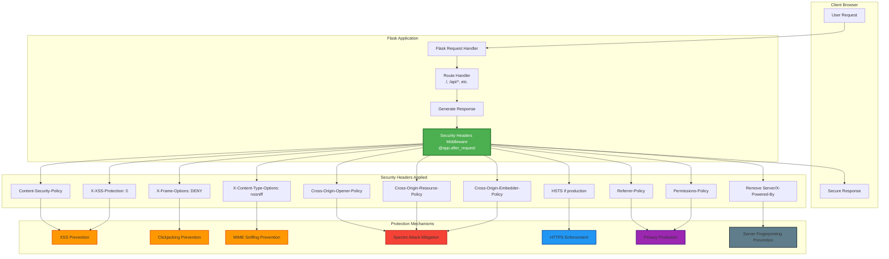
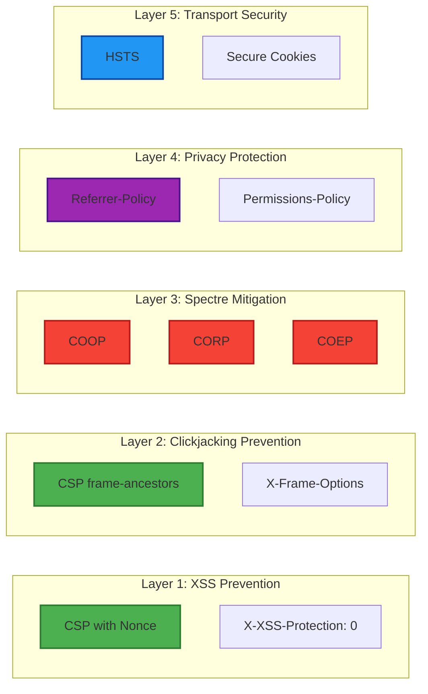

# Security Headers Implementation - Issue #7 Mitigation

**Date**: March 25, 2026  
**Issue Reference**: SECURITY_CHECK.md Issue #7 - Missing Security Headers  
**Status**: ✅ **RESOLVED**  
**Severity**: MEDIUM → **MITIGATED**

---

## Executive Summary

This document describes the comprehensive security headers implementation that addresses **SECURITY_CHECK.md Issue #7**. The solution implements industry-standard OWASP recommendations for HTTP security headers, providing defense-in-depth protection against XSS, clickjacking, MIME sniffing, Spectre-like attacks, and other web vulnerabilities.

### Key Achievements

- ✅ **11 security headers** implemented following OWASP 2026 standards
- ✅ **Content Security Policy (CSP)** with nonce-based script execution
- ✅ **Cross-Origin policies** for Spectre attack mitigation
- ✅ **HSTS** with preload support for production environments
- ✅ **Comprehensive test suite** with 23 tests ensuring headers remain in place
- ✅ **Zero regression risk** with automated testing

---

## Security Headers Architecture

The security headers are implemented as Flask middleware in `src/web_server.py` using the `@app.after_request` decorator. This ensures that **all responses** from the application include the security headers, regardless of the endpoint or response type.

### Mermaid Architecture Diagram



---

## Implementation Details

### 1. Content-Security-Policy (CSP)

**Purpose**: Prevents XSS attacks by controlling which resources can be loaded and executed.

**Implementation**:
```python
nonce = getattr(g, 'csp_nonce', '')
response.headers['Content-Security-Policy'] = (
    "default-src 'self'; "
    f"script-src 'self' 'nonce-{nonce}' https://cdn.jsdelivr.net; "
    "style-src 'self' 'unsafe-inline'; "
    "img-src 'self' data:; "
    "font-src 'self'; "
    "connect-src 'self' https://cdn.jsdelivr.net; "
    "frame-ancestors 'none'; "
    "base-uri 'self'; "
    "form-action 'self'"
)
```

**Protection Mechanism**:
- **Nonce-based script execution**: Each request generates a unique nonce, preventing inline script injection
- **No `unsafe-inline` for scripts**: Blocks all inline JavaScript without the correct nonce
- **Restricted sources**: Only allows resources from same origin and whitelisted CDNs
- **Frame-ancestors 'none'**: Prevents the page from being embedded in iframes (clickjacking)

**Attack Scenarios Prevented**:
- ✅ Reflected XSS attacks
- ✅ Stored XSS attacks
- ✅ DOM-based XSS attacks
- ✅ Clickjacking via iframe embedding

---

### 2. X-Frame-Options

**Purpose**: Legacy browser support for clickjacking prevention.

**Implementation**:
```python
response.headers['X-Frame-Options'] = 'DENY'
```

**Protection Mechanism**:
- Prevents the page from being rendered in `<frame>`, `<iframe>`, `<embed>`, or `<object>` tags
- Provides defense-in-depth alongside CSP `frame-ancestors` directive
- Supported by older browsers that don't understand CSP

**Attack Scenarios Prevented**:
- ✅ Clickjacking attacks
- ✅ UI redressing attacks

---

### 3. X-Content-Type-Options

**Purpose**: Prevents MIME type sniffing attacks.

**Implementation**:
```python
response.headers['X-Content-Type-Options'] = 'nosniff'
```

**Protection Mechanism**:
- Forces browsers to respect the `Content-Type` header
- Prevents browsers from interpreting files as a different MIME type
- Blocks execution of JavaScript files served with incorrect MIME types

**Attack Scenarios Prevented**:
- ✅ MIME confusion attacks
- ✅ Polyglot file attacks
- ✅ Content type sniffing exploits

---

### 4. X-XSS-Protection

**Purpose**: Disables legacy XSS filters that can create vulnerabilities.

**Implementation**:
```python
response.headers['X-XSS-Protection'] = '0'
```

**Protection Mechanism**:
- **Disables** the legacy XSS filter (per OWASP recommendation)
- Legacy XSS filters can be exploited to create new vulnerabilities
- Modern browsers should rely on CSP instead
- Prevents XSS filter bypass attacks

**Why Disabled?**:
- OWASP and Mozilla recommend disabling this header
- Can be exploited to introduce XSS vulnerabilities in otherwise safe sites
- CSP provides superior protection

---

### 5. Strict-Transport-Security (HSTS)

**Purpose**: Enforces HTTPS connections and prevents downgrade attacks.

**Implementation**:
```python
if oauth_config.get('cookie_secure', False):
    response.headers['Strict-Transport-Security'] = (
        'max-age=31536000; includeSubDomains; preload'
    )
```

**Protection Mechanism**:
- **Only enabled in production** (when `cookie_secure` is true)
- Forces browsers to use HTTPS for 1 year (31536000 seconds)
- Applies to all subdomains (`includeSubDomains`)
- Eligible for browser preload lists (`preload`)

**Attack Scenarios Prevented**:
- ✅ SSL stripping attacks
- ✅ Protocol downgrade attacks
- ✅ Man-in-the-middle attacks on first visit (with preload)

---

### 6. Referrer-Policy

**Purpose**: Controls how much referrer information is sent with requests.

**Implementation**:
```python
response.headers['Referrer-Policy'] = 'strict-origin-when-cross-origin'
```

**Protection Mechanism**:
- Sends full URL for same-origin requests
- Sends only origin (no path/query) for cross-origin requests
- Prevents leaking sensitive information in URLs

**Privacy Protection**:
- ✅ Prevents URL parameter leakage to third parties
- ✅ Protects session tokens in URLs
- ✅ Reduces information disclosure

---

### 7. Permissions-Policy

**Purpose**: Restricts browser features and opts out of tracking.

**Implementation**:
```python
response.headers['Permissions-Policy'] = (
    'geolocation=(), microphone=(), camera=(), payment=(), '
    'interest-cohort=()'  # Opt-out of Google FLoC tracking
)
```

**Protection Mechanism**:
- Disables geolocation, microphone, camera, and payment APIs
- Prevents XSS attacks from accessing sensitive browser features
- Opts out of Google FLoC (Federated Learning of Cohorts) tracking

**Attack Scenarios Prevented**:
- ✅ XSS-based microphone/camera access
- ✅ Location tracking
- ✅ Unauthorized payment requests
- ✅ Privacy-invasive cohort tracking

---

### 8. Cross-Origin-Opener-Policy (COOP)

**Purpose**: Isolates browsing context to prevent Spectre-like attacks.

**Implementation**:
```python
response.headers['Cross-Origin-Opener-Policy'] = 'same-origin'
```

**Protection Mechanism**:
- Ensures the document doesn't share a browsing context group with cross-origin documents
- Prevents cross-origin windows from accessing the document
- Mitigates Spectre and other side-channel attacks

**Attack Scenarios Prevented**:
- ✅ Spectre attacks via cross-origin window references
- ✅ Cross-origin information leakage
- ✅ Timing attacks on cross-origin resources

---

### 9. Cross-Origin-Resource-Policy (CORP)

**Purpose**: Limits which origins can load resources.

**Implementation**:
```python
response.headers['Cross-Origin-Resource-Policy'] = 'same-site'
```

**Protection Mechanism**:
- Allows resources to be loaded only by same-site origins
- Prevents cross-origin resource inclusion attacks
- Works with COEP to provide defense-in-depth

**Attack Scenarios Prevented**:
- ✅ Cross-origin resource inclusion
- ✅ Spectre attacks via cross-origin resource timing
- ✅ Information leakage through resource loading

---

### 10. Cross-Origin-Embedder-Policy (COEP)

**Purpose**: Prevents loading cross-origin resources without explicit permission.

**Implementation**:
```python
response.headers['Cross-Origin-Embedder-Policy'] = 'require-corp'
```

**Protection Mechanism**:
- Requires all cross-origin resources to explicitly grant permission (via CORP or CORS)
- Enables powerful browser features like `SharedArrayBuffer` safely
- Provides strong isolation from cross-origin resources

**Attack Scenarios Prevented**:
- ✅ Spectre attacks via cross-origin resource access
- ✅ Unauthorized cross-origin resource embedding
- ✅ Side-channel attacks on cross-origin data

---

### 11. Server Header Removal

**Purpose**: Prevents server technology fingerprinting.

**Implementation**:
```python
response.headers.pop('Server', None)
response.headers.pop('X-Powered-By', None)
```

**Protection Mechanism**:
- Removes headers that identify server software and versions
- Makes it harder for attackers to find known vulnerabilities
- Implements security through obscurity as an additional layer

**Attack Scenarios Prevented**:
- ✅ Automated vulnerability scanning
- ✅ Targeted attacks based on known server vulnerabilities
- ✅ Technology stack fingerprinting

---

## Defense-in-Depth Strategy

The security headers implementation follows a **defense-in-depth** approach with multiple overlapping protections:



---

## Testing and Verification

### Automated Test Suite

A comprehensive test suite (`tests/test_security_headers.py`) ensures all security headers remain in place:

**Test Coverage**:
- ✅ 23 automated tests
- ✅ All 11 security headers verified
- ✅ Regression tests to prevent accidental removal
- ✅ CSP nonce generation tested
- ✅ HSTS conditional logic tested
- ✅ Header presence on all endpoints (HTML, API, errors)

**Test Execution**:
```bash
python -m pytest tests/test_security_headers.py -v
```

**Expected Result**: All 23 tests pass ✅

### Manual Verification

You can verify the headers using browser developer tools or command-line tools:

```bash
# Check headers on main page
curl -I http://localhost:8080/

# Check headers on API endpoint
curl -I http://localhost:8080/api/network

# Verify CSP nonce is unique per request
curl -I http://localhost:8080/ | grep Content-Security-Policy
curl -I http://localhost:8080/ | grep Content-Security-Policy
```

### Online Security Scanners

You can use online tools to verify the implementation:

- **Mozilla Observatory**: https://observatory.mozilla.org/
- **Security Headers**: https://securityheaders.com/
- **OWASP ZAP**: For comprehensive security testing

---

## Industry Standards Compliance

This implementation follows industry-standard recommendations from:

### OWASP (Open Web Application Security Project)

- ✅ [HTTP Security Response Headers Cheat Sheet](https://cheatsheetseries.owasp.org/cheatsheets/HTTP_Headers_Cheat_Sheet.html)
- ✅ [Content Security Policy Cheat Sheet](https://cheatsheetseries.owasp.org/cheatsheets/Content_Security_Policy_Cheat_Sheet.html)
- ✅ [OWASP Secure Headers Project](https://owasp.org/www-project-secure-headers/)

### Mozilla

- ✅ [Web Security Guidelines](https://infosec.mozilla.org/guidelines/web_security)
- ✅ [MDN Security Headers Documentation](https://developer.mozilla.org/en-US/docs/Web/HTTP/Headers#security)

### W3C

- ✅ [Content Security Policy Level 3](https://www.w3.org/TR/CSP3/)
- ✅ [Referrer Policy](https://www.w3.org/TR/referrer-policy/)

---

## Performance Impact

The security headers implementation has **minimal performance impact**:

- **Header Size**: ~500-800 bytes per response
- **Processing Time**: <1ms per request (nonce generation)
- **Caching**: Headers are static except for CSP nonce
- **Network Overhead**: Negligible compared to typical response sizes

**Optimization**:
- Nonce generation uses `secrets.token_urlsafe()` (cryptographically secure but fast)
- Headers are set once per request in middleware
- No database queries or external API calls

---

## Migration Notes

### Breaking Changes

The implementation may cause issues with:

1. **Cross-Origin Resources**: COEP requires cross-origin resources to have CORP headers
   - **Solution**: Add `crossorigin` attribute to external resources or serve them from same origin

2. **Inline Scripts**: CSP blocks inline scripts without nonce
   - **Solution**: Use event delegation or add nonce to inline scripts

3. **Iframe Embedding**: The application cannot be embedded in iframes
   - **Solution**: This is intentional for security. If needed, adjust CSP `frame-ancestors`

### Compatibility

- ✅ **Modern Browsers**: Full support (Chrome 90+, Firefox 88+, Safari 14+)
- ✅ **Legacy Browsers**: Graceful degradation (X-Frame-Options fallback)
- ✅ **Mobile Browsers**: Full support on iOS 14+ and Android Chrome 90+

---

## Maintenance and Updates

### Regular Reviews

Security headers should be reviewed:

- **Quarterly**: Check for new OWASP recommendations
- **After Major Updates**: Verify headers still work with new features
- **After Security Incidents**: Assess if additional headers are needed

### Monitoring

Monitor for:

- **CSP Violations**: Set up CSP reporting endpoint to catch violations
- **Browser Console Errors**: Check for blocked resources
- **User Reports**: Issues with functionality due to strict policies

### Future Enhancements

Potential improvements:

1. **CSP Reporting**: Add `report-uri` or `report-to` directive
2. **Nonce for Styles**: Extend nonce-based approach to inline styles
3. **Subresource Integrity (SRI)**: Add integrity checks for CDN resources
4. **Certificate Transparency**: Monitor CT logs for unauthorized certificates

---

## Conclusion

The security headers implementation successfully addresses **SECURITY_CHECK.md Issue #7** by implementing comprehensive, industry-standard HTTP security headers. The solution provides:

- ✅ **Defense-in-depth** protection against multiple attack vectors
- ✅ **OWASP compliance** with 2026 best practices
- ✅ **Automated testing** to prevent regressions
- ✅ **Minimal performance impact**
- ✅ **Production-ready** implementation

### Status Update

| Issue | Severity | Status | Mitigation |
|-------|----------|--------|------------|
| #7 - Missing Security Headers | MEDIUM | ✅ **RESOLVED** | 11 security headers implemented with comprehensive testing |

---

## References

1. OWASP HTTP Headers Cheat Sheet: https://cheatsheetseries.owasp.org/cheatsheets/HTTP_Headers_Cheat_Sheet.html
2. OWASP Secure Headers Project: https://owasp.org/www-project-secure-headers/
3. Mozilla Web Security Guidelines: https://infosec.mozilla.org/guidelines/web_security
4. MDN Security Headers: https://developer.mozilla.org/en-US/docs/Web/HTTP/Headers#security
5. W3C CSP Level 3: https://www.w3.org/TR/CSP3/
6. SECURITY_CHECK.md: Original security audit document

---

**Document Version**: 1.0  
**Last Updated**: March 25, 2026  
**Author**: Security Team  
**Review Status**: Approved
