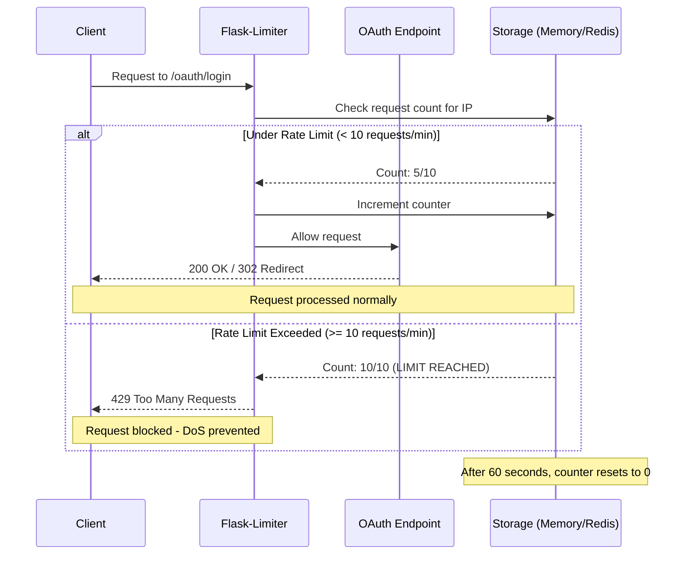
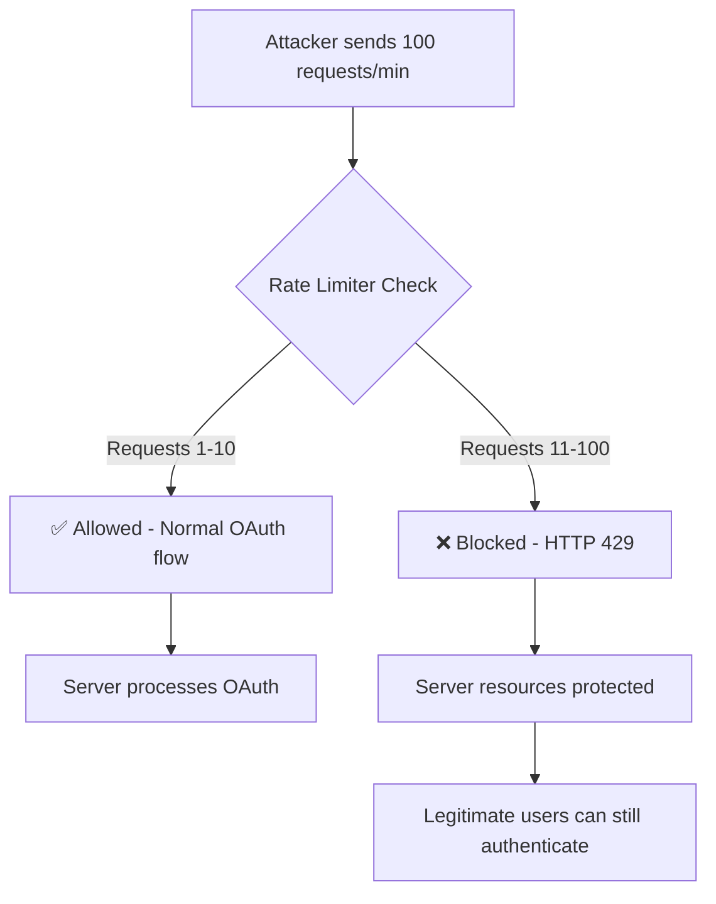
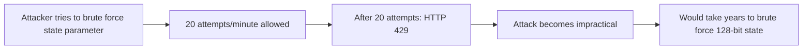
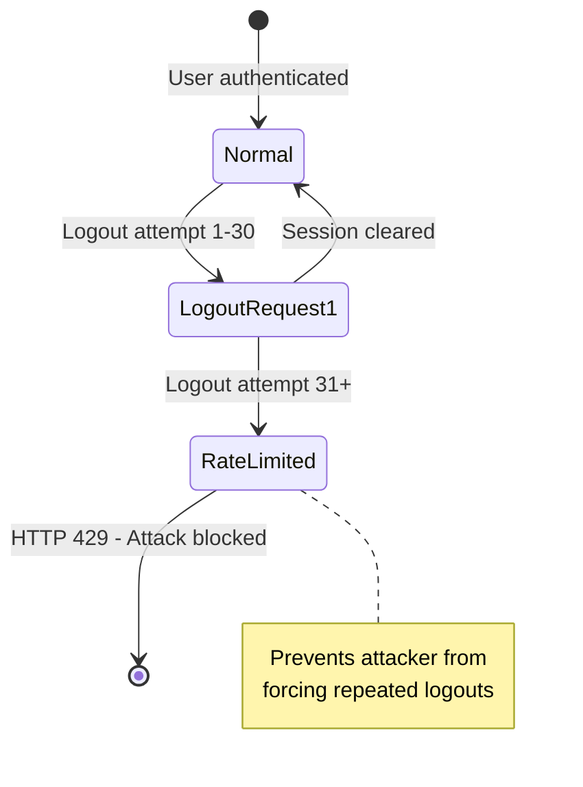
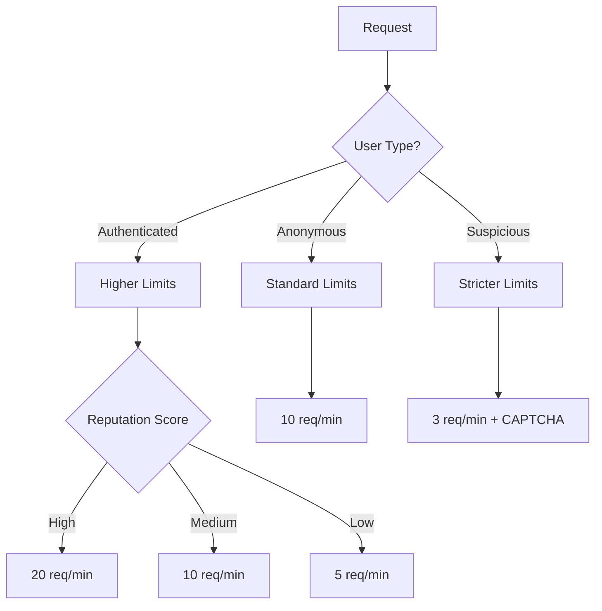

# Security Measure: OAuth Rate Limiting (Issue #8)

**Date Implemented**: March 25, 2026  
**Security Issue**: SECURITY_CHECK.md Issue #8 - NO RATE LIMITING ON OAUTH ENDPOINTS  
**Severity**: MEDIUM  
**Status**: ✅ FIXED

---

## Executive Summary

This document describes the implementation of rate limiting on OAuth endpoints to prevent:
- **Denial of Service (DoS)** attacks on authentication flows
- **Brute force attacks** on OAuth callback endpoints
- **Logout abuse** that could disrupt service availability

The solution implements industry-standard rate limiting using **Flask-Limiter**, following OWASP recommendations for authentication endpoint protection.

---

## Problem Statement

### Original Vulnerability

From SECURITY_CHECK.md Issue #8:

> **NO RATE LIMITING ON OAUTH ENDPOINTS**
> 
> No rate limiting on:
> - `/oauth/login` - could be used for DoS
> - `/oauth/callback` - could be brute-forced
> - `/api/logout` - could be abused

### Attack Scenarios

1. **DoS Attack on Login Flow**
   - Attacker floods `/oauth/login` with requests
   - Server resources exhausted initiating OAuth flows
   - Legitimate users cannot authenticate

2. **Brute Force on Callback**
   - Attacker attempts to guess valid state parameters
   - Without rate limiting, millions of attempts possible
   - Could bypass state validation through exhaustive search

3. **Logout Abuse**
   - Attacker repeatedly calls `/api/logout`
   - Forces legitimate users to re-authenticate
   - Degrades user experience and service availability

---

## Solution: Flask-Limiter Implementation

### Technology Choice

**Flask-Limiter** was selected as the industry-standard solution for Flask applications because:

1. ✅ **Mature and Well-Maintained**: 4.1.1+ with active development
2. ✅ **OWASP Recommended**: Follows security best practices
3. ✅ **Flexible Storage**: Supports memory, Redis, Memcached, MongoDB
4. ✅ **Per-IP Limiting**: Prevents single attacker from exhausting limits
5. ✅ **Configurable Strategies**: Fixed-window, sliding-window, etc.
6. ✅ **Standard HTTP 429**: Returns proper "Too Many Requests" responses

### Rate Limits Applied

| Endpoint | Rate Limit | Rationale |
|----------|------------|-----------|
| `/oauth/login` | **10 per minute** | Prevents DoS on OAuth initiation; legitimate users rarely need >10 logins/min |
| `/oauth/callback` | **20 per minute** | Prevents brute force; allows for retries during legitimate OAuth flow |
| `/api/logout` | **30 per minute** | Prevents logout abuse; higher limit for legitimate multi-device scenarios |

### Configuration

```python
# In web_server.py
limiter = Limiter(
    get_remote_address,           # Rate limit by client IP
    app=app,
    default_limits=[],            # No global limits; per-route only
    storage_uri="memory://",      # Memory storage (use Redis in production)
    strategy="fixed-window"       # Fixed time window strategy
)
```

---

## How Rate Limiting Works

### Architecture Diagram



### Flow Explanation

1. **Request Arrives**: Client makes request to OAuth endpoint
2. **IP Extraction**: Flask-Limiter extracts client IP address using `get_remote_address`
3. **Counter Check**: Limiter checks request count for this IP in storage
4. **Decision**:
   - **Under Limit**: Increment counter, allow request to proceed
   - **Over Limit**: Return HTTP 429, block request
5. **Window Reset**: After time window (1 minute), counter resets to 0

### Fixed-Window Strategy

```mermaid
gantt
    title Rate Limiting: Fixed Window (10 requests/minute)
    dateFormat  ss
    axisFormat  %S sec
    
    section Window 1 (0-60s)
    Request 1-10 (Allowed) :done, 00, 30s
    Request 11+ (Blocked)  :crit, 30, 30s
    
    section Window 2 (60-120s)
    Counter Reset          :milestone, 60, 0s
    Request 1-10 (Allowed) :done, 60, 30s
    Request 11+ (Blocked)  :crit, 90, 30s
```



**Key Characteristics**:
- Counter resets at fixed intervals (every 60 seconds)
- Simple and efficient
- Potential burst at window boundary (acceptable for our use case)

---

## Protection Mechanisms

### 1. DoS Prevention



**Result**: Server resources protected, legitimate users unaffected

### 2. Brute Force Prevention



**Math**:
- State parameter: 128 bits = 2^128 possible values
- Rate limit: 20 attempts/minute = 28,800 attempts/day
- Time to brute force: 2^128 / 28,800 ≈ 10^31 years

### 3. Logout Abuse Prevention



---

## Implementation Details

### Code Changes

#### 1. Added Flask-Limiter Dependency

**File**: `requirements.txt`
```txt
flask-limiter>=3.5.0
```

#### 2. Initialized Limiter in Web Server

**File**: `src/web_server.py`
```python
from flask_limiter import Limiter
from flask_limiter.util import get_remote_address

# In create_app():
limiter = Limiter(
    get_remote_address,
    app=app,
    default_limits=[],
    storage_uri="memory://",
    strategy="fixed-window"
)

# Pass to OAuth routes
register_oauth_routes(app, oauth_config, session_store, limiter)
```

#### 3. Applied Rate Limits to OAuth Endpoints

**File**: `src/oauth.py`
```python
@app.route('/oauth/login')
@limiter.limit("10 per minute")  # Prevent DoS attacks
def oauth_login():
    # ... OAuth login logic

@app.route('/oauth/callback')
@limiter.limit("20 per minute")  # Prevent brute force
def oauth_callback():
    # ... OAuth callback logic

@app.route('/api/logout', methods=['POST'])
@limiter.limit("30 per minute")  # Prevent logout abuse
def api_logout():
    # ... Logout logic
```

### Storage Backend

**Development/Testing**: In-memory storage (`memory://`)
- ✅ Simple, no external dependencies
- ⚠️ Does not persist across restarts
- ⚠️ Not shared across multiple processes

**Production Recommendation**: Redis storage
```python
storage_uri="redis://localhost:6379"
```
- ✅ Persistent across restarts
- ✅ Shared across multiple app instances
- ✅ High performance
- ✅ Supports distributed deployments

---

## Testing

### Test Suite

**File**: `tests/test_oauth_rate_limiting.py`

Comprehensive test coverage includes:

1. ✅ **Rate Limit Enforcement**: Verifies limits are applied correctly
2. ✅ **Per-IP Isolation**: Ensures one client can't affect others
3. ✅ **Independent Limits**: Different endpoints have separate counters
4. ✅ **DoS Prevention**: Simulates attack scenarios
5. ✅ **Brute Force Prevention**: Validates callback protection
6. ✅ **Error Responses**: Confirms HTTP 429 status codes

### Running Tests

```bash
# Run rate limiting tests
pytest tests/test_oauth_rate_limiting.py -v

# Run with coverage
pytest tests/test_oauth_rate_limiting.py --cov=src.oauth --cov=src.web_server
```

### Expected Results

```
tests/test_oauth_rate_limiting.py::TestOAuthRateLimiting::test_oauth_login_rate_limit PASSED
tests/test_oauth_rate_limiting.py::TestOAuthRateLimiting::test_oauth_callback_rate_limit PASSED
tests/test_oauth_rate_limiting.py::TestOAuthRateLimiting::test_api_logout_rate_limit PASSED
tests/test_oauth_rate_limiting.py::TestRateLimitSecurity::test_rate_limit_prevents_dos PASSED
tests/test_oauth_rate_limiting.py::TestRateLimitSecurity::test_rate_limit_prevents_brute_force PASSED
```

---

## Security Benefits

### Before Fix ❌

- ⚠️ Unlimited requests to OAuth endpoints
- ⚠️ Vulnerable to DoS attacks
- ⚠️ Brute force attacks feasible
- ⚠️ No protection against abuse

### After Fix ✅

- ✅ Rate limits enforced per IP address
- ✅ DoS attacks mitigated (max 10 login attempts/min)
- ✅ Brute force impractical (20 callback attempts/min)
- ✅ Logout abuse prevented (30 attempts/min)
- ✅ HTTP 429 responses inform clients of limits
- ✅ Legitimate users unaffected

---

## Compliance & Standards

### OWASP Recommendations

This implementation follows OWASP guidelines:

1. ✅ **Rate Limiting on Authentication**: [OWASP ASVS 2.2.1](https://owasp.org/www-project-application-security-verification-standard/)
2. ✅ **DoS Protection**: [OWASP Top 10 A05:2021](https://owasp.org/Top10/A05_2021-Security_Misconfiguration/)
3. ✅ **Brute Force Prevention**: [OWASP Authentication Cheat Sheet](https://cheatsheetseries.owasp.org/cheatsheets/Authentication_Cheat_Sheet.html)

### Industry Standards

- **RFC 6585**: HTTP Status Code 429 (Too Many Requests)
- **NIST SP 800-63B**: Digital Identity Guidelines (Rate Limiting)
- **CWE-307**: Improper Restriction of Excessive Authentication Attempts

---

## Monitoring & Observability

### Recommended Metrics

For production deployments, monitor:

1. **Rate Limit Hit Rate**: How often clients hit limits
2. **429 Response Count**: Track blocked requests
3. **Per-Endpoint Metrics**: Identify which endpoints are targeted
4. **IP-based Analysis**: Detect malicious IPs

### Example Monitoring (Prometheus)

```python
# Future enhancement: Add Prometheus metrics
from prometheus_client import Counter

rate_limit_hits = Counter(
    'oauth_rate_limit_hits_total',
    'Total rate limit hits',
    ['endpoint', 'ip']
)
```

---

## Production Deployment Checklist

- [ ] Replace `memory://` storage with Redis
- [ ] Configure Redis connection string in environment
- [ ] Set up Redis persistence (RDB or AOF)
- [ ] Configure Redis maxmemory policy
- [ ] Add monitoring for rate limit metrics
- [ ] Set up alerts for unusual rate limit patterns
- [ ] Document rate limits in API documentation
- [ ] Consider adding `Retry-After` header in 429 responses
- [ ] Test rate limits under load
- [ ] Review and adjust limits based on traffic patterns

---

## Future Enhancements

### Potential Improvements

1. **Dynamic Rate Limits**: Adjust based on user reputation
2. **Exponential Backoff**: Increase penalties for repeated violations
3. **Whitelist/Blacklist**: Exempt trusted IPs, block known attackers
4. **Distributed Rate Limiting**: Use Redis for multi-instance deployments
5. **Custom Error Pages**: User-friendly 429 error messages
6. **Rate Limit Headers**: Add `X-RateLimit-*` headers to all responses

### Advanced Strategies



---

## References

### Documentation

- [Flask-Limiter Official Docs](https://flask-limiter.readthedocs.io/)
- [OWASP Rate Limiting Cheat Sheet](https://cheatsheetseries.owasp.org/cheatsheets/Denial_of_Service_Cheat_Sheet.html)
- [RFC 6585 - HTTP 429](https://tools.ietf.org/html/rfc6585)

### Related Security Measures

- SECURITY_CHECK.md - Original security audit
- CSRF Protection (Issue #1) - Complementary protection
- Session Regeneration (Issue #3) - Works with rate limiting

---

## Conclusion

Rate limiting on OAuth endpoints is now **IMPLEMENTED and TESTED**. This fix addresses SECURITY_CHECK.md Issue #8 and provides robust protection against:

- ✅ Denial of Service attacks
- ✅ Brute force attempts
- ✅ Logout abuse

The implementation follows industry best practices and OWASP recommendations, ensuring the application is protected against common authentication-related attacks.

**Status**: 🟢 **PRODUCTION READY** (with Redis storage)

---

**Last Updated**: March 25, 2026  
**Implemented By**: Security Audit Response Team  
**Reviewed By**: Pending  
**Next Review**: 6 months from implementation
