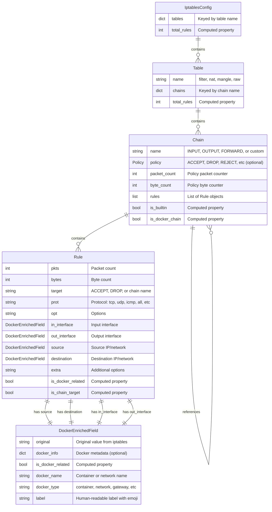
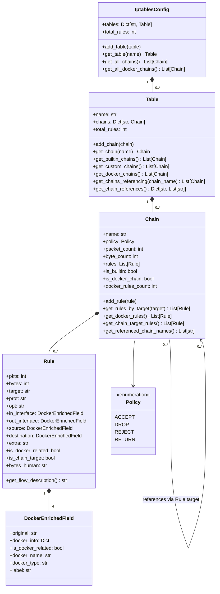
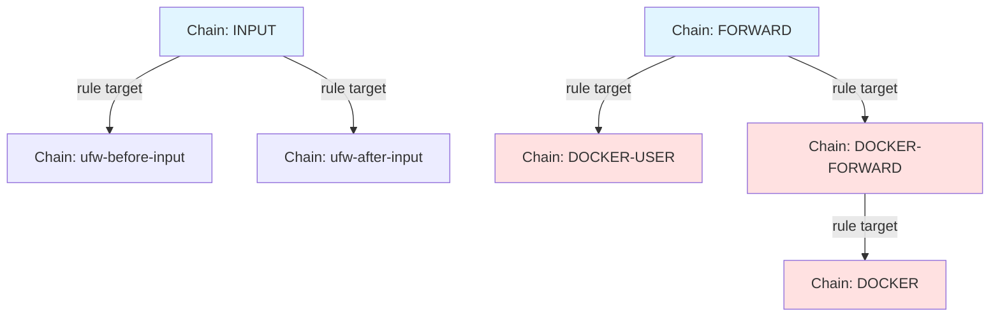
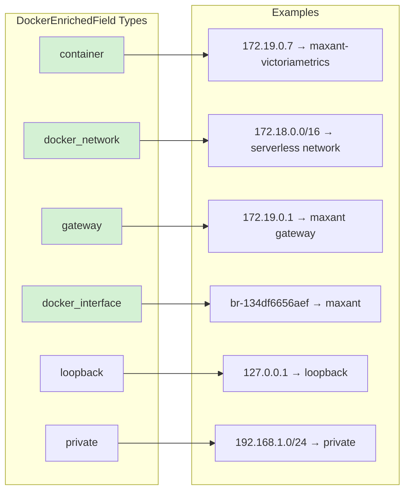
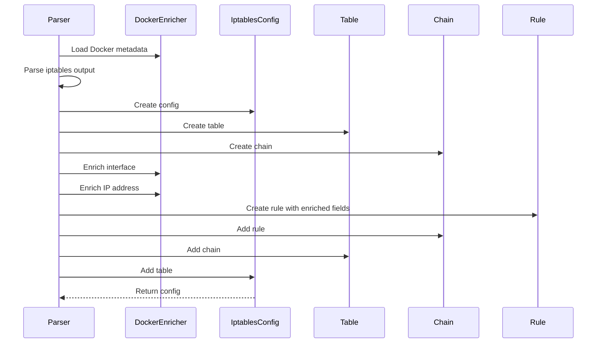

# iptables Data Model

This document describes the data model for representing iptables configuration in memory.

## Entity Relationship Diagram

## Class Hierarchy

## Chain References

Chains can reference other chains through rule targets. When a rule's target is not a terminal action (ACCEPT, DROP, REJECT, etc.), it references another chain.

## Docker Enrichment Types

## Data Flow

## Key Concepts

### Chain References
- Rules can target other chains (not just terminal actions)
- `Rule.is_chain_target` identifies rules that reference chains
- `Chain.get_referenced_chain_names()` returns list of referenced chains
- `Table.get_chain_references()` builds dependency graph
- `Table.get_chains_referencing(name)` finds chains that reference a specific chain

### Docker Enrichment
- `DockerEnrichedField` wraps original values with Docker metadata
- Automatically populated by `DockerEnricher` during parsing
- Stores container names, network names, and human-readable labels
- Enables Docker-aware filtering and visualization

### Built-in vs Custom Chains
- Built-in chains: INPUT, OUTPUT, FORWARD, PREROUTING, POSTROUTING
- Custom chains: Created by users or Docker
- Docker chains: Names starting with "DOCKER" or "docker"

### Terminal Actions
Terminal actions that end rule processing:
- ACCEPT
- DROP
- REJECT
- RETURN
- QUEUE
- LOG
- MASQUERADE
- SNAT
- DNAT

Non-terminal targets are chain references.
